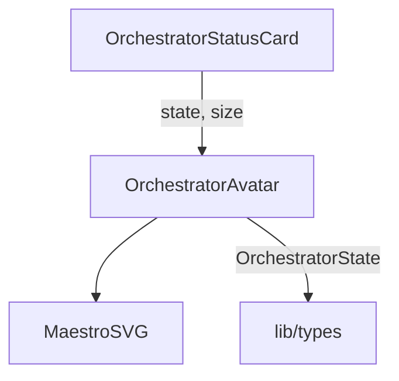

# `OrchestratorAvatar.tsx` — 编排器 Maestro 头像组件

> 源文件路径: `ui/src/components/OrchestratorAvatar.tsx`

## 功能概述

`OrchestratorAvatar` 是并行模式下编排器（Orchestrator）的可视化头像组件。它以"Maestro"（机器人指挥家）的形象呈现，包含指挥帽、燕尾服、指挥棒等 SVG 细节。头像会根据编排器的不同状态（初始化、调度、生成、监控、完成等）展示对应的动画效果和光晕样式。

## 依赖关系

### 导入依赖

| 模块 | 说明 |
|------|------|
| `../lib/types` | `OrchestratorState` 编排器状态类型 |

### 被依赖

| 模块 | 引用内容 |
|------|----------|
| `OrchestratorStatusCard.tsx` | 在编排器状态卡片中展示 Maestro 头像 |

## 关键组件/函数

### `OrchestratorAvatar`

- **Props**: `state`（编排器状态）、`size`（`'sm'` / `'md'` / `'lg'`，默认 `'md'`）
- **渲染逻辑**: 根据 size 映射 SVG 尺寸（32/48/64px），组合动画和光晕样式

### `MaestroSVG`

- 内部 SVG 组件，绘制机器人指挥家形象
- 指挥棒根据状态添加动画类（`animate-conducting` / `animate-baton-tap`）
- `spawning` 和 `monitoring` 状态下显示音符图标

### 辅助函数

- `getStateAnimation(state)` — 根据状态返回 CSS 动画类名
- `getStateGlow(state)` — 根据状态返回发光阴影效果
- `getStateDescription(state)` — 返回无障碍可读的状态描述

## 架构图

## 注意事项

- 使用紫罗兰色系配色方案（`MAESTRO_COLORS`），与 Agent 头像的配色风格区分
- 动画变换原点（`transformOrigin`）精确设置以确保指挥棒旋转自然
- 组件设有 ARIA 属性（`role="status"`, `aria-label`, `aria-live="polite"`）确保无障碍访问
