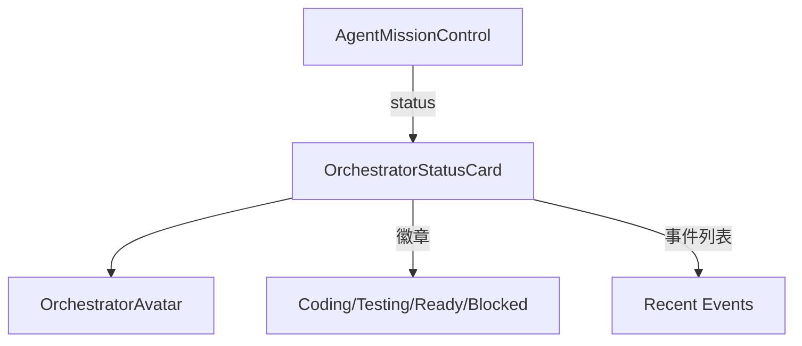

# `OrchestratorStatusCard.tsx` — 编排器状态卡片

> 源文件路径: `ui/src/components/OrchestratorStatusCard.tsx`

## 功能概述

`OrchestratorStatusCard` 展示并行模式下编排器（Orchestrator）的当前状态概览。包括 Maestro 头像、状态文本描述、当前消息，以及编码/测试 Agent 数量、就绪队列、阻塞数量等状态徽章。还支持展开查看最近的编排事件时间线。

## 依赖关系

### 导入依赖

| 模块 | 说明 |
|------|------|
| `react` | `useState` |
| `lucide-react` | `ChevronDown`, `ChevronUp`, `Code`, `FlaskConical`, `Clock`, `Lock`, `Sparkles` 图标 |
| `./OrchestratorAvatar` | Maestro 头像组件 |
| `../lib/types` | `OrchestratorStatus`, `OrchestratorState` 类型 |
| `@/components/ui/card` | `Card`, `CardContent` |
| `@/components/ui/button` | `Button` |
| `@/components/ui/badge` | `Badge` |

### 被依赖

| 模块 | 引用内容 |
|------|----------|
| `AgentMissionControl.tsx` | 在任务控制中心面板内展示编排器状态 |

## 关键组件/函数

### `OrchestratorStatusCard`

- **Props**: `status`（`OrchestratorStatus` 对象）
- **状态管理**: `showEvents` — 是否展开最近事件列表
- **展示内容**:
  - Maestro 头像 + 状态文本（带颜色标识）
  - 当前消息（最多2行截断）
  - 四种状态徽章：Coding agents、Testing agents、Ready queue、Blocked count（>0时显示）
  - 可折叠的最近事件时间线（相对时间格式）

### 辅助函数

- `getStateText(state)` — 返回友好的状态文本（如"Deploying agents..."）
- `getStateColor(state)` — 返回状态对应的文本颜色类
- `formatRelativeTime(timestamp)` — 格式化相对时间（"just now"、"5s ago"等）

## 架构图

## 注意事项

- Blocked 徽章仅在 `blockedCount > 0` 时显示，避免信息噪声
- 使用 `line-clamp-2` 限制消息文本行数，防止卡片过高
- 状态徽章使用浅色背景配色（如 `bg-blue-100 text-blue-700`），并提供暗色模式适配
