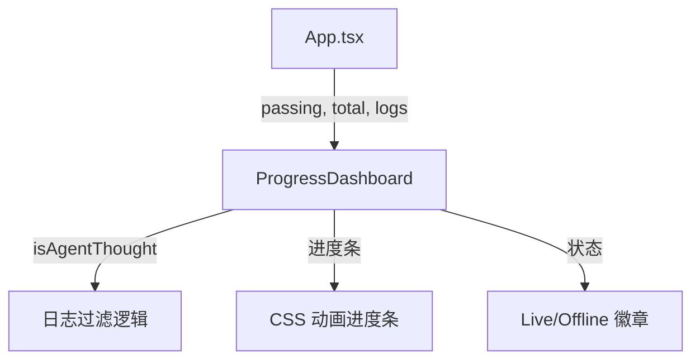

# `ProgressDashboard.tsx` — 进度仪表板组件

> 源文件路径: `ui/src/components/ProgressDashboard.tsx`

## 功能概述

`ProgressDashboard` 是应用的核心进度展示组件，显示功能特性的完成进度条、通过/总数统计、WebSocket 连接状态，以及 Agent 的最新思考内容。思考内容会通过淡入淡出动画平滑过渡，并在 Agent 运行时显示脑图标和闪光效果。

## 依赖关系

### 导入依赖

| 模块 | 说明 |
|------|------|
| `react` | `useMemo`, `useState`, `useEffect` |
| `lucide-react` | `Wifi`, `WifiOff`, `Brain`, `Sparkles` 图标 |
| `@/components/ui/card` | `Card`, `CardContent`, `CardHeader`, `CardTitle` |
| `@/components/ui/badge` | `Badge` |
| `../lib/types` | `AgentStatus` 类型 |

### 被依赖

| 模块 | 引用内容 |
|------|----------|
| `App.tsx` | 在主界面顶部展示总体进度 |

## 关键组件/函数

### `ProgressDashboard`

- **Props**: `passing`、`total`、`percentage`、`isConnected`、`logs`（日志数组）、`agentStatus`
- **状态管理**:
  - `displayedThought` — 当前显示的思考内容
  - `textVisible` — 文本可见性（控制淡入淡出过渡）
- **展示内容**:
  - 标题 "Progress" + WebSocket 连接状态徽章（Live/Offline）
  - 数字统计（passing/total）
  - 进度条（带 500ms 过渡动画）
  - Agent 最新思考气泡（仅在运行中或短暂暂停时显示）

### `isAgentThought(line)` / `getLatestThought(logs)`

- 判断日志行是否为 Agent 的"思考"（叙述性文本），过滤掉工具调用、JSON 输出、路径等技术性内容
- 从日志末尾向前搜索最新的思考内容

## 架构图

## 注意事项

- 思考内容显示有30秒空闲超时（`IDLE_TIMEOUT`），暂停超过30秒后自动隐藏
- 文本切换使用150ms淡出 + 淡入动画，避免内容突变
- `isAgentThought` 函数与 `AgentThought.tsx` 中的逻辑基本相同（代码复用）
- 进度条末尾的冒号会被自动去除（`replace(/:$/, '')`）
