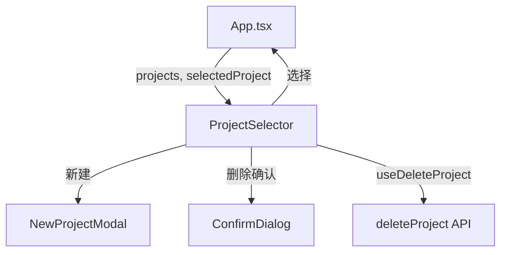

# `ProjectSelector.tsx` — 项目选择下拉菜单组件

> 源文件路径: `ui/src/components/ProjectSelector.tsx`

## 功能概述

`ProjectSelector` 是应用顶栏中的项目选择器，以下拉菜单形式展示已注册的所有项目，并允许用户切换、创建和删除项目。已选项目显示完成百分比徽章，下拉列表中每个项目显示 passing/total 进度。底部提供"New Project"选项打开新项目创建模态框。

## 依赖关系

### 导入依赖

| 模块 | 说明 |
|------|------|
| `react` | `useState` |
| `lucide-react` | `ChevronDown`, `Plus`, `FolderOpen`, `Loader2`, `Trash2` 图标 |
| `../lib/types` | `ProjectSummary` 类型 |
| `./NewProjectModal` | 新项目创建模态框 |
| `./ConfirmDialog` | 删除确认对话框 |
| `../hooks/useProjects` | `useDeleteProject` mutation hook |
| `@/components/ui/button` | `Button` |
| `@/components/ui/badge` | `Badge` |
| `@/components/ui/dropdown-menu` | `DropdownMenu`, `DropdownMenuContent`, `DropdownMenuItem`, `DropdownMenuSeparator`, `DropdownMenuTrigger` |

### 被依赖

| 模块 | 引用内容 |
|------|----------|
| `App.tsx` | 作为主应用顶栏的项目选择组件 |

## 关键组件/函数

### `ProjectSelector`

- **Props**: `projects`、`selectedProject`、`onSelectProject`、`isLoading`、`onSpecCreatingChange`
- **状态管理**:
  - `isOpen` — 下拉菜单开关
  - `showNewProjectModal` — 新项目模态框开关
  - `projectToDelete` — 待删除项目名称
- **交互逻辑**:
  - 点击下拉项选择项目，触发器按钮显示选中项目名和进度
  - 每项右侧有垃圾桶按钮，通过 `stopPropagation` 阻止误触选择
  - 删除确认后调用 `deleteProject.mutateAsync`，如删除的是当前项目则重置选择
  - 新项目创建完成后自动选中并关闭下拉菜单
  - `onSpecCreatingChange` 回调通知父组件 Spec 创建聊天的进入/退出状态

## 架构图

## 注意事项

- 按钮的 `title` 属性设置为项目路径，悬停时可查看完整路径
- 下拉列表最大高度 300px，超出可滚动
- 触发器按钮在加载中显示旋转加载图标，宽度自适应但有最小宽度限制
