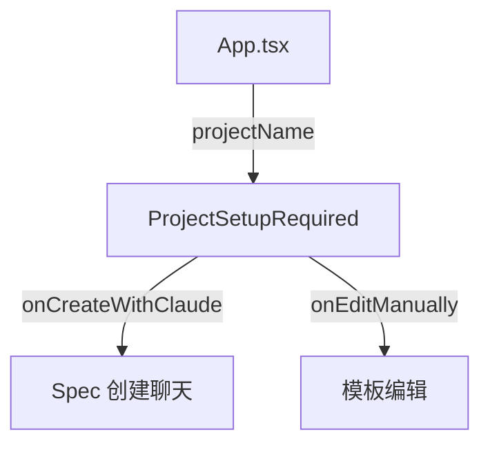

# `ProjectSetupRequired.tsx` — 项目配置引导页

> 源文件路径: `ui/src/components/ProjectSetupRequired.tsx`

## 功能概述

`ProjectSetupRequired` 在项目缺少 App Spec 时显示的引导页面。提供两种创建方式的选择卡片：**用 Claude 创建**（通过 AI 聊天交互生成 Spec）和**手动编辑模板**（自行创建提示词目录和文件）。帮助用户快速启动项目的初始配置流程。

## 依赖关系

### 导入依赖

| 模块 | 说明 |
|------|------|
| `lucide-react` | `Sparkles`, `FileEdit`, `FolderOpen` 图标 |
| `@/components/ui/button` | `Button` |
| `@/components/ui/card` | `Card`, `CardContent`, `CardDescription`, `CardHeader`, `CardTitle` |

### 被依赖

| 模块 | 引用内容 |
|------|----------|
| `App.tsx` | 当选中项目无 App Spec 时展示此引导页 |

## 关键组件/函数

### `ProjectSetupRequired`

- **Props**: `projectName`、`projectPath`（可选，显示项目路径）、`onCreateWithClaude`（AI 创建回调）、`onEditManually`（手动编辑回调）
- **布局**: 居中卡片内的两列网格，每列为一个可点击的选择卡片
  - "Create with Claude" — 紫色闪光图标，"Start Chat" 按钮
  - "Edit Templates Manually" — 灰色编辑图标，"View Templates" 按钮（outline 样式）
- 底部有简短说明文字解释 App Spec 的作用

## 架构图

## 注意事项

- 两种选项卡片均可整体点击（`onClick` 绑定在 `Card` 上），悬停有边框和阴影变化
- 项目路径以 `<code>` 标签展示，仅在 `projectPath` 有值时显示
- 最大宽度限制为 `max-w-2xl`，居中显示
