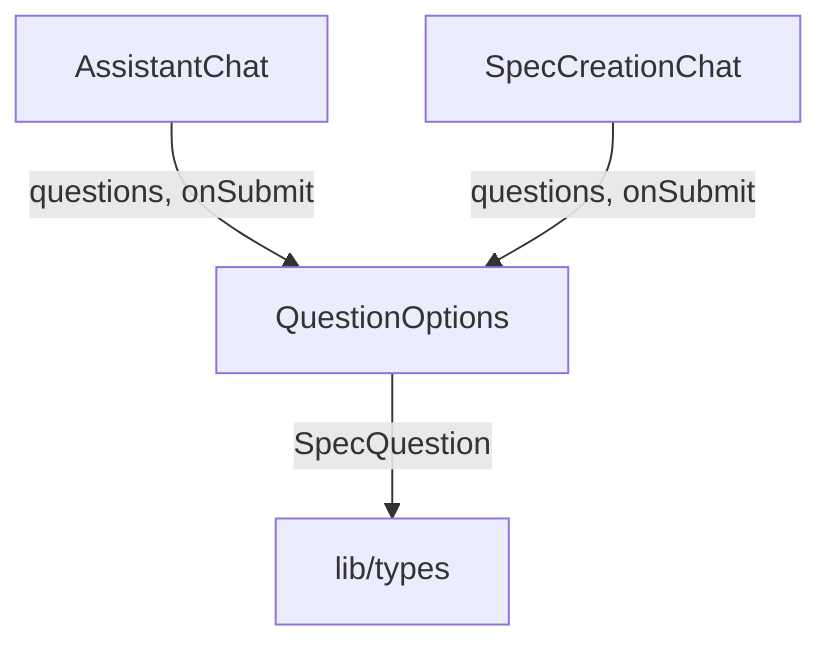

# `QuestionOptions.tsx` — 结构化问题选项交互组件

> 源文件路径: `ui/src/components/QuestionOptions.tsx`

## 功能概述

`QuestionOptions` 用于渲染 `AskUserQuestion` 工具返回的结构化问题列表。每个问题包含若干预定义选项（支持单选和多选），以及一个"Other"自定义输入选项。用户回答所有问题后可以提交答案。该组件在 Spec 创建聊天和助手聊天中都有使用。

## 依赖关系

### 导入依赖

| 模块 | 说明 |
|------|------|
| `react` | `useState` 状态管理 |
| `lucide-react` | `Check` 勾选图标 |
| `../lib/types` | `SpecQuestion` 问题类型定义 |
| `@/components/ui/button` | `Button` |
| `@/components/ui/input` | `Input` |
| `@/components/ui/card` | `Card`, `CardContent` |
| `@/components/ui/badge` | `Badge` |

### 被依赖

| 模块 | 引用内容 |
|------|----------|
| `AssistantChat.tsx` | 在助手聊天中渲染结构化问题 |
| `SpecCreationChat.tsx` | 在 Spec 创建聊天中渲染结构化问题 |

## 关键组件/函数

### `QuestionOptions`

- **Props**: `questions`（问题数组）、`onSubmit`（提交答案回调）、`disabled`（是否禁用交互）
- **状态管理**:
  - `answers` — 各问题的答案（单选为字符串，多选为字符串数组）
  - `customInputs` — "Other" 选项的自定义输入文本
  - `showCustomInput` — 各问题是否展示自定义输入框
- **交互逻辑**:
  - 单选模式：点击选项直接替换当前答案
  - 多选模式：点击选项切换选中/取消选中状态
  - "Other" 选项：展开文本输入框，自定义内容作为答案
  - 仅当所有问题都有答案时才能提交

## 架构图

## 注意事项

- 问题以网格布局（1-2列）展示选项，每个选项卡片式设计
- 多选模式下显示"(select multiple)"提示文本
- 选中状态通过 checkbox/radio 样式的圆形/方形指示器区分单选和多选
