# React 组件

> `ui/src/components/` 目录包含 AutoForge 前端的所有 React 组件，共 47 个业务组件和 14 个 UI 基础组件。

## 目录结构

```
components/
├── ui/                         # UI 基础组件库 (14 文件) → 详见 ui/README.md
├── KanbanBoard.tsx             # 看板容器
├── KanbanColumn.tsx            # 看板列
├── DependencyGraph.tsx         # 依赖关系图
├── AgentMissionControl.tsx     # 多 Agent 仪表板
├── ProgressDashboard.tsx       # 进度仪表板
├── FeatureCard.tsx             # 特性卡片
├── FeatureModal.tsx            # 特性详情模态窗
├── AddFeatureForm.tsx          # 添加特性表单
├── EditFeatureForm.tsx         # 编辑特性表单
├── AgentCard.tsx               # Agent 卡片
├── AgentAvatar.tsx             # Agent 头像
├── AgentControl.tsx            # Agent 控制面板
├── AgentThought.tsx            # Agent 思考气泡
├── OrchestratorAvatar.tsx      # 编排器头像
├── OrchestratorStatusCard.tsx  # 编排器状态卡片
├── ProjectSelector.tsx         # 项目选择器
├── NewProjectModal.tsx         # 新建项目向导
├── ProjectSetupRequired.tsx    # 项目设置提示
├── FolderBrowser.tsx           # 文件系统浏览器
├── ResetProjectModal.tsx       # 重置项目模态窗
├── SpecCreationChat.tsx        # Spec 创建聊天
├── ExpandProjectChat.tsx       # 项目扩展聊天
├── ExpandProjectModal.tsx      # 项目扩展模态窗
├── AssistantChat.tsx           # AI 助手聊天
├── AssistantPanel.tsx          # AI 助手面板
├── AssistantFAB.tsx            # 助手浮动按钮
├── ChatMessage.tsx             # 聊天消息渲染
├── ConversationHistory.tsx     # 对话历史列表
├── QuestionOptions.tsx         # 选项卡片
├── DebugLogViewer.tsx          # 调试日志查看器
├── Terminal.tsx                # xterm.js 终端
├── TerminalTabs.tsx            # 多标签终端
├── SettingsModal.tsx           # 设置模态窗
├── ScheduleModal.tsx           # 定时调度模态窗
├── DevServerControl.tsx        # 开发服务器控制
├── DevServerConfigDialog.tsx   # 开发服务器配置
├── CelebrationOverlay.tsx      # 庆祝动画遮罩
├── ActivityFeed.tsx            # 活动流
├── DependencyBadge.tsx         # 依赖徽章
├── ThemeSelector.tsx           # 主题选择器
├── KeyboardShortcutsHelp.tsx   # 快捷键帮助
├── ViewToggle.tsx              # 视图切换
├── TypingIndicator.tsx         # 输入指示器
├── ConfirmDialog.tsx           # 确认对话框
├── SetupWizard.tsx             # 初始设置向导
├── HumanInputForm.tsx          # 人工输入表单
└── mascotData.tsx              # 吉祥物 SVG 数据
```

## 组件分类

### 主要容器

| 组件 | 行数 | 说明 |
|------|------|------|
| `KanbanBoard.tsx` | 92 | 四列看板容器（Pending / In Progress / Needs Input / Done），支持新特性按钮和 Spec 创建入口 |
| `KanbanColumn.tsx` | 127 | 单个看板列，显示特性卡片计数和列表，带动画入场效果 |
| `DependencyGraph.tsx` | 438 | 基于 React Flow + dagre 的交互式依赖关系图，自动布局，节点颜色映射特性状态，支持 Agent 工作指示 |
| `AgentMissionControl.tsx` | 168 | 多 Agent 仪表板，显示编排器状态、活跃 Agent 卡片网格和活动流 |
| `ProgressDashboard.tsx` | 153 | 顶部进度条，显示通过数/总数/百分比，连接状态指示，单 Agent 时显示最新日志和状态 |

### 特性管理

| 组件 | 行数 | 说明 |
|------|------|------|
| `FeatureCard.tsx` | 129 | 看板中的特性卡片，显示名称/分类/依赖/Agent 状态，支持 Agent 工作高亮 |
| `FeatureModal.tsx` | 345 | 特性详情模态窗，显示完整信息、步骤列表、依赖管理，支持编辑/删除/跳过操作 |
| `AddFeatureForm.tsx` | 224 | 添加特性表单，包含分类/名称/描述/步骤字段，支持动态步骤增删 |
| `EditFeatureForm.tsx` | 242 | 编辑特性表单，预填现有数据，支持分类/名称/描述/步骤/优先级修改 |
| `DependencyBadge.tsx` | 121 | 依赖状态徽章，显示已满足/未满足/被阻塞依赖数量及详情 |
| `HumanInputForm.tsx` | 150 | 人工输入表单，支持 text/textarea/select/boolean 字段类型，Agent 请求人工介入时使用 |

### Agent 相关

| 组件 | 行数 | 说明 |
|------|------|------|
| `AgentCard.tsx` | 255 | Agent 卡片，显示吉祥物头像、名称、状态动画、思考气泡、当前特性、日志预览 |
| `AgentAvatar.tsx` | 118 | Agent 吉祥物头像，根据状态播放不同动画（thinking/working/testing/celebrate/shake） |
| `AgentControl.tsx` | 237 | Agent 启停控制面板，包含并发数选择、YOLO 模式切换、启动/停止/暂停/恢复按钮 |
| `AgentThought.tsx` | 145 | Agent 思考气泡组件，弹出式显示当前思考内容 |
| `OrchestratorAvatar.tsx` | 190 | 编排器（Maestro）头像，指挥棒动画，根据编排器状态显示不同效果 |
| `OrchestratorStatusCard.tsx` | 167 | 编排器状态卡片，显示状态、Agent 数量、就绪/阻塞计数、最近事件 |
| `mascotData.tsx` | 529 | 5 个 Agent 吉祥物 SVG 数据（Spark/Fizz/Octo/Hoot/Buzz）+ Maestro 编排器头像 |

### 项目管理

| 组件 | 行数 | 说明 |
|------|------|------|
| `ProjectSelector.tsx` | 177 | 项目下拉选择器，支持搜索过滤、新建项目入口、Spec 创建流程 |
| `NewProjectModal.tsx` | 600 | 新建项目多步向导，包含项目名称输入、文件夹浏览选择、Spec 方式选择（Claude AI / 手动） |
| `ProjectSetupRequired.tsx` | 90 | 项目无 Spec 时的设置提示页面，引导用户创建 Spec 或手动编辑 |
| `FolderBrowser.tsx` | 343 | 服务端文件系统浏览器，支持目录导航、新建文件夹、路径手动输入、Windows 驱动器列表 |
| `ResetProjectModal.tsx` | 194 | 项目重置模态窗，支持快速重置（仅清特性）和完全重置（删除 Spec + 特性） |

### 聊天/交互

| 组件 | 行数 | 说明 |
|------|------|------|
| `SpecCreationChat.tsx` | 518 | Spec 创建全屏聊天界面，WebSocket 双向通信，支持图片上传、问题选项、Spec 完成后自动启动 Agent |
| `ExpandProjectChat.tsx` | 393 | 项目扩展聊天，自然语言描述新功能，AI 分析后批量创建特性 |
| `ExpandProjectModal.tsx` | 41 | 项目扩展模态窗容器，封装 ExpandProjectChat |
| `AssistantChat.tsx` | 315 | AI 助手聊天组件，支持工具调用显示、Markdown 渲染、会话管理 |
| `AssistantPanel.tsx` | 224 | AI 助手侧滑面板，包含对话历史列表和聊天窗口 |
| `AssistantFAB.tsx` | 25 | 助手浮动操作按钮（FAB），右下角固定定位 |
| `ChatMessage.tsx` | 147 | 通用聊天消息渲染，支持 Markdown、图片附件、用户/助手/系统角色区分 |
| `ConversationHistory.tsx` | 215 | 对话历史列表，支持新建/选择/删除对话 |
| `QuestionOptions.tsx` | 221 | 问题选项卡片组件，支持单选/多选，用于 Spec 创建交互 |
| `TypingIndicator.tsx` | 29 | 三点跳动输入指示器动画 |

### UI 工具

| 组件 | 行数 | 说明 |
|------|------|------|
| `DebugLogViewer.tsx` | 586 | 底部可调大小的调试面板，多标签页（Agent 日志 / 终端 / Dev 日志），ANSI 颜色解析，日志过滤 |
| `Terminal.tsx` | 586 | 基于 xterm.js 的终端组件，WebSocket 双向 I/O，支持 Fit 插件和 Web Links 插件 |
| `TerminalTabs.tsx` | 251 | 多标签终端管理器，支持创建/关闭/重命名终端标签页 |
| `SettingsModal.tsx` | 485 | 全局设置模态窗，包含 API 提供商选择、模型选择、YOLO 模式、批量大小、测试 Agent 比例、Playwright 无头模式 |
| `ScheduleModal.tsx` | 403 | 定时调度模态窗，支持创建/编辑/删除/启停调度，时间选择（本地时区 ↔ UTC 转换），星期位域选择 |
| `DevServerControl.tsx` | 198 | 开发服务器启停控制，显示运行状态和访问 URL |
| `DevServerConfigDialog.tsx` | 182 | 开发服务器配置对话框，支持自动检测和自定义命令 |

### 其他

| 组件 | 行数 | 说明 |
|------|------|------|
| `CelebrationOverlay.tsx` | 122 | 特性完成庆祝动画遮罩，显示 Agent 名称和特性名称，canvas-confetti 彩纸特效 |
| `ActivityFeed.tsx` | 115 | 最近活动流列表，显示 Agent 名称、思考内容和时间戳 |
| `ThemeSelector.tsx` | 172 | 主题选择下拉菜单，预览色块，支持 6 个主题切换 |
| `KeyboardShortcutsHelp.tsx` | 91 | 键盘快捷键帮助模态窗 |
| `ViewToggle.tsx` | 37 | 看板/图视图切换按钮组 |
| `ConfirmDialog.tsx` | 78 | 通用确认对话框，支持自定义标题/描述/按钮文本 |
| `SetupWizard.tsx` | 188 | 初始设置向导，检查 Claude CLI / 凭证 / Node / npm 环境 |

## 组件层级图

```mermaid
graph TB
    App["App.tsx"]

    subgraph "布局层"
        Header["Header<br/>品牌 + 项目选择 + 工具栏"]
        Main["Main<br/>主内容区"]
        Debug["DebugLogViewer<br/>底部面板"]
        Assistant["AssistantPanel<br/>侧边面板"]
    end

    subgraph "容器层"
        Kanban["KanbanBoard"]
        Graph["DependencyGraph"]
        Mission["AgentMissionControl"]
        Progress["ProgressDashboard"]
    end

    subgraph "特性层"
        Column["KanbanColumn"]
        FCard["FeatureCard"]
        FModal["FeatureModal"]
        AddF["AddFeatureForm"]
        EditF["EditFeatureForm"]
        DepBadge["DependencyBadge"]
        HInput["HumanInputForm"]
    end

    subgraph "Agent 层"
        ACard["AgentCard"]
        AAvatar["AgentAvatar"]
        ACtrl["AgentControl"]
        AThought["AgentThought"]
        OAvatar["OrchestratorAvatar"]
        OStatus["OrchestratorStatusCard"]
        Activity["ActivityFeed"]
        Mascots["mascotData.tsx"]
    end

    subgraph "聊天层"
        SpecChat["SpecCreationChat"]
        ExpandChat["ExpandProjectChat"]
        AssistChat["AssistantChat"]
        ChatMsg["ChatMessage"]
        ConvHist["ConversationHistory"]
        QOptions["QuestionOptions"]
        Typing["TypingIndicator"]
    end

    subgraph "项目层"
        ProjSel["ProjectSelector"]
        NewProj["NewProjectModal"]
        ProjSetup["ProjectSetupRequired"]
        FolderBr["FolderBrowser"]
        ResetProj["ResetProjectModal"]
    end

    subgraph "工具层"
        Terminal["Terminal"]
        TermTabs["TerminalTabs"]
        Settings["SettingsModal"]
        Schedule["ScheduleModal"]
        DevSrv["DevServerControl"]
        DevCfg["DevServerConfigDialog"]
        Celebrate["CelebrationOverlay"]
        Theme["ThemeSelector"]
        KBHelp["KeyboardShortcutsHelp"]
        View["ViewToggle"]
        Confirm["ConfirmDialog"]
        Setup["SetupWizard"]
    end

    App --> Header
    App --> Main
    App --> Debug
    App --> Assistant

    Header --> ProjSel
    Header --> ACtrl
    Header --> DevSrv
    Header --> Theme
    Header --> Settings

    Main --> Progress
    Main --> Mission
    Main --> View
    Main --> Kanban
    Main --> Graph

    Kanban --> Column
    Column --> FCard
    FCard --> DepBadge

    Mission --> OStatus
    Mission --> ACard
    Mission --> Activity
    OStatus --> OAvatar
    ACard --> AAvatar
    ACard --> AThought
    AAvatar --> Mascots

    FModal --> EditF
    FModal --> DepBadge
    FModal --> HInput

    Assistant --> AssistChat
    Assistant --> ConvHist
    AssistChat --> ChatMsg
    AssistChat --> Typing

    SpecChat --> ChatMsg
    SpecChat --> QOptions
    ExpandChat --> ChatMsg

    Debug --> TermTabs
    TermTabs --> Terminal

    DevSrv --> DevCfg

    ProjSel --> NewProj
    NewProj --> FolderBr
```



## 依赖关系

### 外部依赖

| 组件 | 使用的主要外部库 |
|------|------------------|
| `DependencyGraph` | `@xyflow/react`, `dagre` |
| `Terminal` | `@xterm/xterm`, `@xterm/addon-fit`, `@xterm/addon-web-links` |
| `CelebrationOverlay` | `canvas-confetti` |
| `ChatMessage`, `AssistantChat` | `react-markdown`, `remark-gfm` |
| `SettingsModal`, `DebugLogViewer` 等 | `lucide-react` (图标) |
| UI 基础组件 | `@radix-ui/*`, `class-variance-authority` |

### 内部依赖

所有业务组件依赖：
- `@/components/ui/*` -- 基础 UI 组件
- `@/lib/types` -- TypeScript 类型定义
- `@/lib/utils` -- `cn()` 样式合并函数
- `@/hooks/*` -- 自定义 Hooks（按需引用）
- `@/lib/api` -- REST API 客户端（按需引用）

## 关键模式

1. **模态窗管理**: 所有模态窗状态集中在 `App.tsx`，通过 props 控制开/关，Escape 按优先级逐层关闭
2. **吉祥物系统**: 5 个 Agent 吉祥物（Spark/Fizz/Octo/Hoot/Buzz）+ Maestro 编排器，每个有独立 SVG + 状态动画
3. **实时更新**: Agent 卡片和看板通过 WebSocket 推送实时更新，无需手动刷新
4. **聊天架构**: 三种聊天组件（Spec/Expand/Assistant）共享 `ChatMessage` 和 `TypingIndicator`，各自有独立的 WebSocket Hook
5. **可调面板**: `DebugLogViewer` 支持拖拽调节高度，主内容区 padding 随之动态调整
