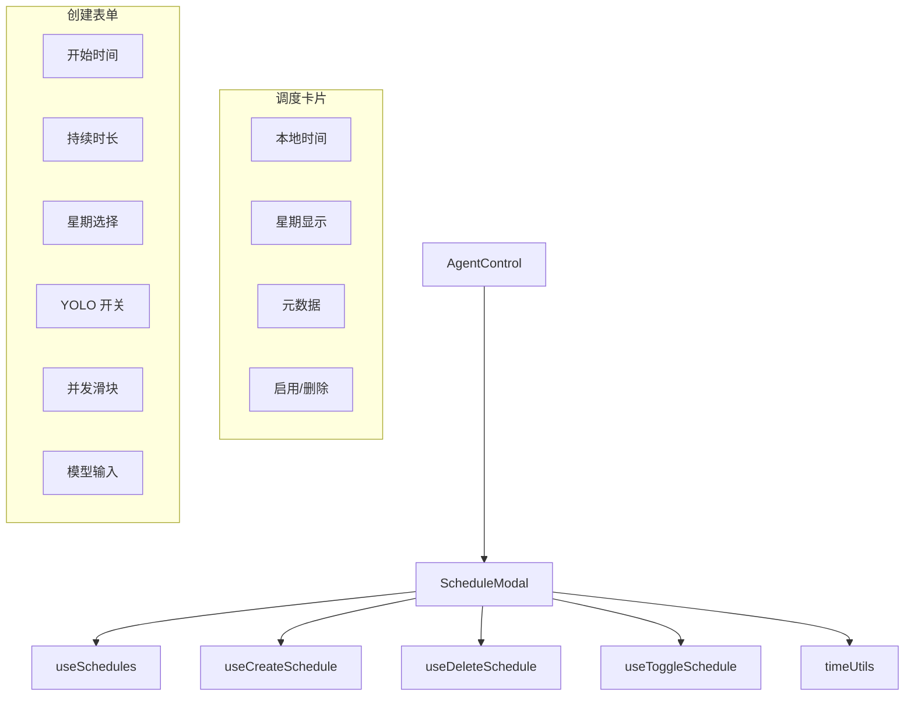

# `ScheduleModal.tsx` -- Agent 定时调度管理模态框

> 源文件路径: `ui/src/components/ScheduleModal.tsx`

## 功能概述

`ScheduleModal` 是 Agent 定时调度的管理界面，允许用户创建、查看、启用/禁用和删除定时调度计划。每个调度定义了 Agent 的运行时间窗口（开始时间 + 持续时长）、运行日期、并发数等参数。

该组件的核心特性是时区处理：用户在界面上以本地时间输入调度时间，组件内部通过 `timeUtils` 工具库将其转换为 UTC 存储，并在显示时逆向转换回本地时间。这确保了跨时区环境下调度的正确性。日期位掩码（bitmask）同样根据时区偏移进行调整。

模态框分为上下两部分：上方展示已有的调度计划卡片列表（包含时间、日期、元数据和操作按钮），下方是新调度的创建表单（时间、持续时长、星期选择、YOLO 模式、并发数、可选模型）。

## 依赖关系

### 导入依赖

| 模块 | 说明 |
|------|------|
| `react` | `useState`, `useEffect`, `useRef` -- React Hooks |
| `lucide-react` | Clock, GitBranch, Trash2 图标 |
| `../hooks/useSchedules` | `useSchedules`, `useCreateSchedule`, `useDeleteSchedule`, `useToggleSchedule` |
| `../lib/timeUtils` | 时区转换工具函数（utcToLocalWithDayShift 等） |
| `../lib/types` | `ScheduleCreate` 类型 |
| `@/components/ui/dialog` | Dialog 系列组件 |
| `@/components/ui/button` | Button 组件 |
| `@/components/ui/input` | Input 组件 |
| `@/components/ui/label` | Label 组件 |
| `@/components/ui/alert` | Alert, AlertDescription 组件 |
| `@/components/ui/card` | Card, CardContent 组件 |
| `@/components/ui/checkbox` | Checkbox 组件 |
| `@/components/ui/separator` | Separator 组件 |

### 被依赖

| 模块 | 引用内容 |
|------|----------|
| `ui/src/components/AgentControl.tsx` | 导入 `ScheduleModal`，通过时钟按钮打开 |

## 关键组件/函数

### `ScheduleModal`

**Props:**
- `projectName: string` -- 项目名称
- `isOpen: boolean` -- 控制模态框显示
- `onClose: () => void` -- 关闭回调

**表单状态（newSchedule）:**
- `start_time: string` -- 本地开始时间（默认 "22:00"）
- `duration_minutes: number` -- 持续时长（默认 240 分钟）
- `days_of_week: number` -- 星期位掩码（默认 31 = 工作日）
- `enabled: boolean` -- 是否启用
- `yolo_mode: boolean` -- YOLO 模式
- `model: string | null` -- 可选的指定模型
- `max_concurrency: number` -- 并发 Agent 数（默认 3）

**核心操作:**
- `handleCreateSchedule()` -- 验证并创建调度（含时区转换）
- `handleToggleSchedule()` -- 启用/禁用已有调度
- `handleDeleteSchedule()` -- 删除调度（带确认对话框）
- `handleToggleDay()` -- 切换星期位掩码

**时区处理流程:**
1. 用户输入本地时间
2. `localToUTCWithDayShift()` 转换为 UTC 时间并计算日偏移
3. `adjustDaysForDayShift()` 根据日偏移调整星期位掩码
4. 显示时通过 `utcToLocalWithDayShift()` 逆向转换

**验证规则:**
- 至少选择一天（`days_of_week !== 0`）
- 持续时长 1-1440 分钟（最长 24 小时）

## 架构图

## 注意事项

- 星期使用 7 位二进制位掩码表示（bit 0 = 周一, ... , bit 6 = 周日），默认 31 = 工作日
- 所有时间以 UTC 存储，显示时转换为本地时间，确保跨时区正确性
- 并发数范围 1-5，使用原生 range input 控件
- 持续时长输入做了防御性处理：NaN 回退到 1，范围限制在 1-1440
- 删除操作使用浏览器原生 `confirm()` 对话框
- 调度卡片显示崩溃次数（`crash_count`）以红色标注
- 模态框最大宽度 650px，最大高度 80vh，内容区域可滚动
