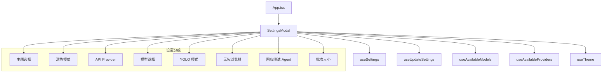

# `SettingsModal.tsx` -- 全局设置模态框（主题、模型、Provider、Agent 配置）

> 源文件路径: `ui/src/components/SettingsModal.tsx`

## 功能概述

`SettingsModal` 是 AutoForge 的全局设置面板，提供了应用外观和 Agent 行为的集中配置入口。用户可以通过键盘快捷键 `,` 打开此面板。

面板涵盖以下设置类别：
1. **主题选择** -- 支持多套预定义主题，带颜色预览色块和选中标记
2. **深色模式** -- 明暗主题切换
3. **API Provider** -- 支持 Claude（默认）、GLM、Ollama、Kimi、Custom、Azure 等多种提供商
4. **模型选择** -- 根据 Provider 动态加载可用模型列表，支持自定义模型名称输入
5. **YOLO 模式** -- 跳过测试的快速原型模式开关
6. **Headless 浏览器** -- Playwright 无头模式开关
7. **回归测试 Agent 数量** -- 0-3 可选
8. **Coding/Testing Agent 批次大小** -- 1-15 滑块控制

每项设置在修改后立即通过 mutation 保存到后端，无需手动提交。

## 依赖关系

### 导入依赖

| 模块 | 说明 |
|------|------|
| `react` | `useState` -- React Hook |
| `lucide-react` | 图标组件（Loader2, AlertCircle, Check, Moon, Sun, Eye, EyeOff, ShieldCheck） |
| `../hooks/useProjects` | `useSettings`, `useUpdateSettings`, `useAvailableModels`, `useAvailableProviders` |
| `../hooks/useTheme` | `useTheme`, `THEMES` -- 主题管理 hook |
| `../lib/types` | `ProviderInfo` 类型 |
| `@/components/ui/dialog` | Dialog 系列组件 |
| `@/components/ui/switch` | Switch 开关组件 |
| `@/components/ui/slider` | Slider 滑块组件 |
| `@/components/ui/label` | Label 组件 |
| `@/components/ui/alert` | Alert, AlertDescription 组件 |
| `@/components/ui/button` | Button 组件 |

### 被依赖

| 模块 | 引用内容 |
|------|----------|
| `ui/src/App.tsx` | 导入 `SettingsModal`，通过 `showSettings` 状态控制显示 |

## 关键组件/函数

### `SettingsModal`

**Props:**
- `isOpen: boolean` -- 控制模态框显示
- `onClose: () => void` -- 关闭回调

**数据获取:**
- `useSettings()` -- 获取当前全局设置
- `useAvailableModels()` -- 获取可用模型列表
- `useAvailableProviders()` -- 获取可用 API Provider 列表
- `useTheme()` -- 获取当前主题和深色模式状态

**设置项处理函数:**
- `handleYoloToggle()` -- 切换 YOLO 模式
- `handleModelChange(modelId)` -- 切换模型
- `handleProviderChange(providerId)` -- 切换 Provider 并重置 auth 状态
- `handleTestingRatioChange(ratio)` -- 设置回归测试 Agent 数量
- `handleBatchSizeChange(size)` -- 设置 Coding Agent 批次大小
- `handleTestingBatchSizeChange(size)` -- 设置 Testing Agent 批次大小
- `handleSaveAuthToken()` -- 保存 API 密钥
- `handleSaveCustomBaseUrl()` -- 保存自定义 Base URL
- `handleSaveCustomModel()` -- 保存自定义模型名称

**条件渲染逻辑:**
- `showAuthField` -- 非 Claude Provider 且需要认证时显示 API Key 输入
- `showBaseUrlField` -- Custom 或 Azure Provider 时显示 Base URL 输入
- `showCustomModelInput` -- Custom 或 Ollama Provider 时显示自定义模型输入

## 架构图

## 注意事项

- 所有设置修改即时保存，使用 `updateSettings.mutate()` 立即提交到后端
- API Key 使用密码输入框，支持显示/隐藏切换
- 已配置的 API Key 显示绿色盾牌图标和"Configured"文字，需点击"Change"才能修改
- Provider 信息文本通过 `PROVIDER_INFO_TEXT` 常量映射
- 模态框最大宽度 `sm:max-w-lg`，最大高度 `90vh`，内容区域可滚动
- Slider 组件范围 1-15 用于批次大小控制
- 回归测试 Agent 使用分段按钮选择（0/1/2/3）
