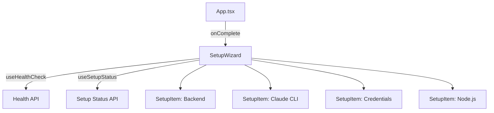

# `SetupWizard.tsx` — 初始设置向导组件

> 源文件路径: `ui/src/components/SetupWizard.tsx`

## 功能概述

`SetupWizard` 是应用的初始设置检查页面，在首次启动或环境未就绪时展示。它检查四项前提条件：后端服务器健康状态、Claude CLI 安装情况、Anthropic API 凭据配置、以及 Node.js 安装（可选）。当所有必要条件满足时，自动调用 `onComplete` 回调进入主界面。

## 依赖关系

### 导入依赖

| 模块 | 说明 |
|------|------|
| `react` | `useEffect`, `useCallback` |
| `lucide-react` | `CheckCircle2`, `XCircle`, `Loader2`, `ExternalLink` 图标 |
| `../hooks/useProjects` | `useSetupStatus`（检查 CLI/凭据）、`useHealthCheck`（API 健康检查） |
| `@/components/ui/button` | `Button` |
| `@/components/ui/card` | `Card`, `CardContent` |
| `@/components/ui/alert` | `Alert`, `AlertDescription`, `AlertTitle` |

### 被依赖

| 模块 | 引用内容 |
|------|----------|
| `App.tsx` | 作为应用启动时的首屏组件 |

## 关键组件/函数

### `SetupWizard`

- **Props**: `onComplete`（所有检查通过后的回调）
- **检查逻辑**:
  - `useHealthCheck` — 轮询后端 `/health` 接口
  - `useSetupStatus` — 检查 `claude_cli`、`credentials`、`node` 状态
  - 条件: `health.status === 'healthy' && claude_cli && credentials`
- **自动完成**: 使用 `useCallback` + `useEffect` 组合避免无限循环，条件满足时自动跳转

### `SetupItem`

- 内部子组件，展示单个检查项的状态
- **Props**: `label`、`description`、`status`（`'success'`/`'error'`/`'warning'`/`'loading'`）、`helpLink`、`helpText`、`optional`
- 错误或警告状态下显示帮助链接

## 架构图

## 注意事项

- Node.js 检查为可选项，状态为 `'warning'` 而非 `'error'`，不阻塞继续操作
- 所有条件就绪后同时显示"Continue to Dashboard"按钮和自动触发完成回调
- 帮助链接在新窗口打开（`target="_blank"`），指向 Anthropic 文档或 Node.js 官网
