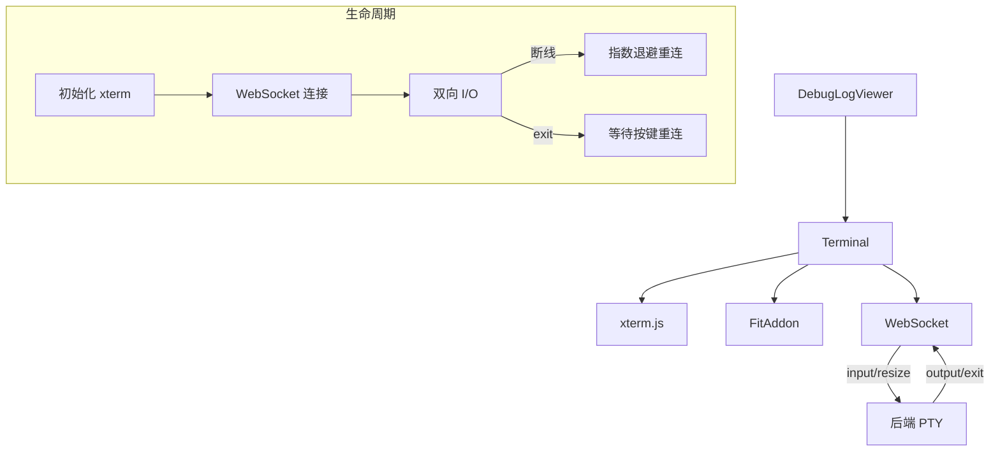

# `Terminal.tsx` -- 基于 xterm.js 的交互式终端组件

> 源文件路径: `ui/src/components/Terminal.tsx`

## 功能概述

`Terminal` 组件基于 xterm.js 实现了完整的终端仿真功能，通过 WebSocket 连接到后端 PTY（伪终端）实现双向 I/O 通信。它支持终端尺寸自适应（FitAddon）、断线指数退避重连、进程退出后按任意键重连等交互模式。

组件通过 Base64 编解码处理 Unicode 安全的数据传输，采用 JSON 消息协议与后端交互。WebSocket 消息分为三种类型：input（用户输入）、resize（终端尺寸变更）和 output/exit（服务端输出/退出通知）。

在多终端切换场景中，组件通过精心设计的 ref 管理和 `isActive` 属性控制来避免竞态条件，确保非活动终端保持 WebSocket 连接和缓冲区内容。激活时使用双 requestAnimationFrame 确保布局稳定后再执行 fit 操作。

## 依赖关系

### 导入依赖

| 模块 | 说明 |
|------|------|
| `react` | `useEffect`, `useRef`, `useCallback`, `useState` -- React Hooks |
| `@xterm/xterm` | `Terminal as XTerm` -- xterm.js 终端库 |
| `@xterm/addon-fit` | `FitAddon` -- 终端自适应容器尺寸插件 |
| `@xterm/xterm/css/xterm.css` | xterm.js 样式表 |

### 被依赖

| 模块 | 引用内容 |
|------|----------|
| `ui/src/components/DebugLogViewer.tsx` | 导入 `Terminal` 组件，在终端标签页中渲染 |

## 关键组件/函数

### `Terminal`

**Props:**
- `projectName: string` -- 项目名称，用于 WebSocket URL
- `terminalId: string` -- 终端标识符
- `isActive: boolean` -- 是否为当前活动终端

**状态管理:**
- `isConnected` / `hasExited` / `exitCode` -- 连接状态追踪
- 大量 `useRef` 用于避免闭包过期问题（`isActiveRef`, `hasExitedRef`, `connectRef`, `isManualCloseRef` 等）

**核心流程:**
1. `initializeTerminal()` -- 创建 xterm.js 实例，配置主题、字体、滚动缓冲区
2. `connect()` -- 建立 WebSocket 连接到 `/api/terminal/ws/{project}/{terminal}`
3. `fitTerminal()` -- 使用 FitAddon 适应容器尺寸并通知服务端
4. `sendResize()` -- 向服务端发送终端尺寸变更消息
5. 断线重连使用指数退避策略（1s 基础延迟，最长 30s）

**WebSocket 消息协议:**
```typescript
// 客户端发送
{ type: 'input', data: string }   // Base64 编码的用户输入
{ type: 'resize', cols: number, rows: number }  // 终端尺寸

// 服务端发送
{ type: 'output', data: string }   // Base64 编码的终端输出
{ type: 'exit', code: number }     // 进程退出
```

**终端主题配置:**
- 背景色: zinc-950 (`#09090b`)
- 前景色: zinc-50 (`#fafafa`)
- 光标: blue-500 (`#3b82f6`)
- 完整的 16 色 ANSI 调色板

## 架构图



## 注意事项

- 使用 `isActiveRef` 替代直接引用 `isActive` prop，避免 setTimeout 回调中的闭包过期问题
- `isManualCloseRef` 标记手动断开，防止项目/终端切换时的自动重连竞态
- 非活动终端不关闭 WebSocket，保留连接和缓冲区以支持无缝切换
- 激活时使用双 `requestAnimationFrame` + 16ms setTimeout 确保布局计算完成
- FitAddon 的 `proposeDimensions()` 在容器不可见时可能返回无效值，需要防御性检查
- 重连延迟基础值 1000ms，最大 30000ms，采用指数退避策略
- 进程退出后在终端显示黄色提示信息，按任意键触发重连
