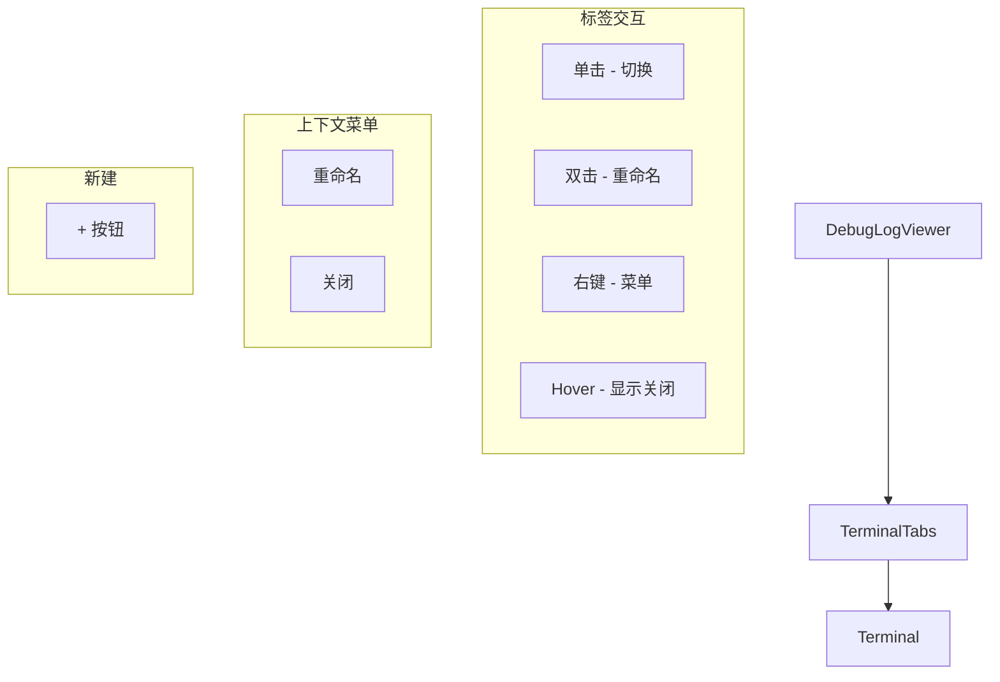

# `TerminalTabs.tsx` -- 多终端标签栏管理组件

> 源文件路径: `ui/src/components/TerminalTabs.tsx`

## 功能概述

`TerminalTabs` 是终端标签栏组件，提供多终端会话的标签页管理功能，类似于 VS Code 或 iTerm2 的终端标签栏。它支持以下交互：

- **标签切换**: 单击标签切换活动终端
- **内联重命名**: 双击标签名称进入编辑模式，支持 Enter 提交和 Escape 取消
- **右键菜单**: 右键点击标签显示上下文菜单（Rename / Close）
- **创建新终端**: 右侧 + 按钮创建新的终端会话
- **关闭终端**: hover 时显示 X 按钮，仅在有多个终端时可关闭

组件的视觉风格使用深色终端主题（zinc-800/zinc-900 背景），活动标签使用主色调高亮。标签名称支持截断显示（最大 120px 宽度）。

## 依赖关系

### 导入依赖

| 模块 | 说明 |
|------|------|
| `react` | `useState`, `useRef`, `useEffect`, `useCallback` -- React Hooks |
| `lucide-react` | Plus, X 图标 |
| `@/lib/types` | `TerminalInfo` 类型 |
| `@/lib/keyboard` | `isSubmitEnter` -- 提交快捷键检测 |
| `@/components/ui/button` | Button 组件 |
| `@/components/ui/input` | Input 组件 |

### 被依赖

| 模块 | 引用内容 |
|------|----------|
| `ui/src/components/DebugLogViewer.tsx` | 导入 `TerminalTabs`，在终端标签页中渲染标签栏 |

## 关键组件/函数

### `TerminalTabs`

**Props:**
- `terminals: TerminalInfo[]` -- 终端列表
- `activeTerminalId: string | null` -- 当前活动终端 ID
- `onSelect: (terminalId: string) => void` -- 选择终端回调
- `onCreate: () => void` -- 创建新终端回调
- `onRename: (terminalId: string, newName: string) => void` -- 重命名回调
- `onClose: (terminalId: string) => void` -- 关闭终端回调

**状态管理:**
- `editingId` / `editValue` -- 内联编辑状态
- `contextMenu: ContextMenuState` -- 右键菜单状态（visible, x, y, terminalId）

**交互处理:**
- `startEditing(terminal)` -- 进入编辑模式，设置初始值并关闭右键菜单
- `submitEdit()` -- 提交编辑（非空时调用 onRename）
- `cancelEdit()` -- 取消编辑
- `handleDoubleClick(terminal)` -- 双击触发编辑
- `handleContextMenu(e, terminalId)` -- 右键显示上下文菜单
- `handleContextMenuRename()` -- 菜单中选择重命名
- `handleContextMenuClose()` -- 菜单中选择关闭
- `handleClose(e, terminalId)` -- 标签关闭按钮（阻止事件冒泡）

**编辑模式输入框:**
- 宽度 `w-24`，高度 `h-6`
- 自动聚焦并全选文本
- `onBlur` 时自动提交
- `onClick` 阻止事件冒泡（防止触发标签选择）

**右键菜单:**
- 使用 `fixed` 定位于鼠标点击位置
- 包含 Rename 和 Close（仅多终端时可见）选项
- 点击外部自动关闭（通过 mousedown 事件监听）

## 架构图

## 注意事项

- 关闭按钮使用 `opacity-0 group-hover:opacity-100` 实现 hover 时才显示
- 仅当 `terminals.length > 1` 时才显示关闭按钮和菜单中的 Close 选项
- 活动标签关闭按钮的 hover 使用 `bg-black/20`，非活动标签使用 `bg-white/20`
- 编辑输入框使用 `e.stopPropagation()` 防止点击输入框触发标签选择
- 右键菜单通过 `document.addEventListener('mousedown', ...)` 实现外部点击关闭
- 标签容器使用 `overflow-x-auto` 支持标签超出时的水平滚动
- 终端名称使用等宽字体 `font-mono`，最大宽度 120px 截断
