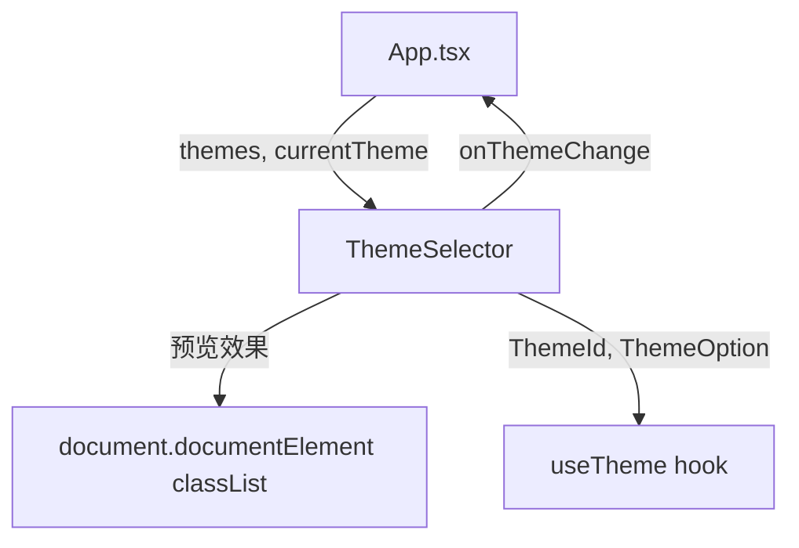

# `ThemeSelector.tsx` — 主题选择器组件

> 源文件路径: `ui/src/components/ThemeSelector.tsx`

## 功能概述

`ThemeSelector` 是一个支持悬停预览的主题切换下拉菜单组件。鼠标悬停在某个主题选项上时，会实时预览该主题的配色效果（通过操作 `document.documentElement` 的 CSS 类名实现）。鼠标离开后恢复当前主题。点击主题项则永久切换到该主题。

## 依赖关系

### 导入依赖

| 模块 | 说明 |
|------|------|
| `react` | `useState`, `useRef`, `useEffect` |
| `lucide-react` | `Palette`, `Check` 图标 |
| `@/components/ui/button` | `Button` |
| `@/components/ui/tooltip` | `Tooltip`, `TooltipTrigger`, `TooltipContent` |
| `../hooks/useTheme` | `ThemeId`, `ThemeOption` 类型定义 |

### 被依赖

| 模块 | 引用内容 |
|------|----------|
| `App.tsx` | 在应用顶栏中作为主题选择按钮 |

## 关键组件/函数

### `ThemeSelector`

- **Props**: `themes`（可选主题列表）、`currentTheme`（当前主题 ID）、`onThemeChange`（切换回调）
- **状态管理**:
  - `isOpen` — 下拉菜单是否展开
  - `previewTheme` — 当前预览中的主题 ID（null 表示无预览）
- **交互逻辑**:
  - 鼠标悬停触发器按钮展开菜单，离开后延迟 150ms 关闭（避免闪烁）
  - 悬停主题项时通过 `useEffect` 临时应用主题类名到 `<html>` 元素
  - `useEffect` 的 cleanup 函数负责恢复原始主题
  - 每个主题项显示三个颜色色板（background、primary、accent）、名称、描述和选中勾

## 架构图

## 注意事项

- 支持的主题：`claude`、`neo-brutalism`、`retro-arcade`、`aurora`、`business`
- 预览通过直接操作 DOM 类名实现，`useEffect` cleanup 确保状态一致性
- 下拉菜单使用 `animate-slide-in-down` 自定义动画
- 点击外部区域自动关闭（通过 `mousedown` 事件和 ref 检测）
