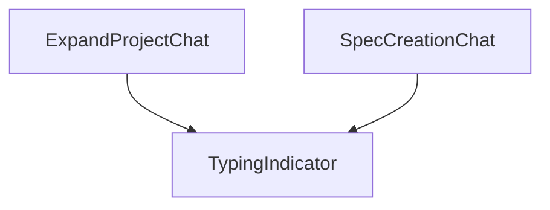

# `TypingIndicator.tsx` — 打字指示器组件

> 源文件路径: `ui/src/components/TypingIndicator.tsx`

## 功能概述

`TypingIndicator` 是一个简单的动画指示器组件，用于在聊天界面中显示 Claude 正在思考/输入的状态。包含三个间隔跳动的圆点和"Claude is thinking..."文字提示。

## 依赖关系

### 导入依赖

| 模块 | 说明 |
|------|------|
| （无外部依赖） | 纯 TSX 组件，仅使用 Tailwind CSS 类 |

### 被依赖

| 模块 | 引用内容 |
|------|----------|
| `ExpandProjectChat.tsx` | 在扩展项目聊天中显示等待指示器 |
| `SpecCreationChat.tsx` | 在 Spec 创建聊天中显示等待指示器 |

## 关键组件/函数

### `TypingIndicator`

- **Props**: 无
- **渲染**: 三个 `animate-bounce` 圆点，依次延迟 0ms、150ms、300ms，形成波浪跳动效果
- **文本**: 灰色等宽字体 "Claude is thinking..."

## 架构图

## 注意事项

- 组件无状态、无 props，是最简单的纯展示组件
- 三个圆点使用 `animationDelay` 内联样式实现错开的弹跳效果
- 使用主色调（`bg-primary`）圆点和灰色（`text-muted-foreground`）文字
