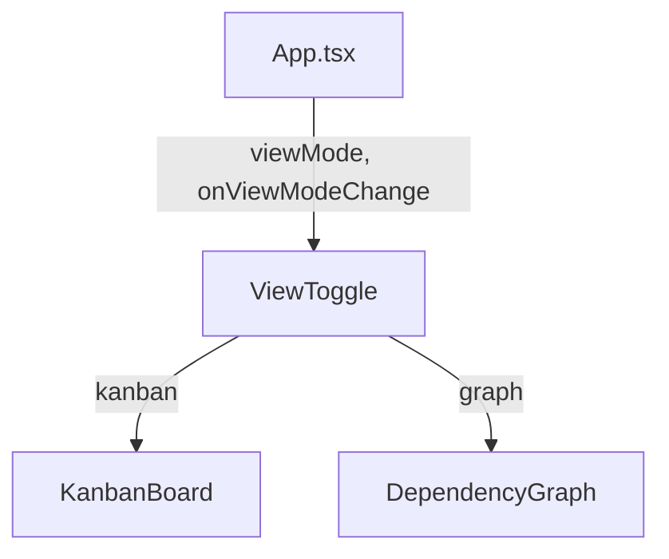

# `ViewToggle.tsx` — 看板/图形视图切换按钮

> 源文件路径: `ui/src/components/ViewToggle.tsx`

## 功能概述

`ViewToggle` 是一个简洁的视图切换按钮组，允许用户在看板视图（Kanban）和依赖图形视图（Graph）之间切换。同时导出 `ViewMode` 类型供其他组件使用。

## 依赖关系

### 导入依赖

| 模块 | 说明 |
|------|------|
| `lucide-react` | `LayoutGrid`（看板图标）、`GitBranch`（图形图标） |
| `@/components/ui/button` | `Button` |

### 被依赖

| 模块 | 引用内容 |
|------|----------|
| `App.tsx` | 在主界面中使用，同时导入 `ViewToggle` 组件和 `ViewMode` 类型 |

## 关键组件/函数

### `ViewToggle`

- **Props**: `viewMode`（当前视图模式）、`onViewModeChange`（切换回调）
- **类型导出**: `ViewMode = 'kanban' | 'graph'`
- **渲染**: 两个按钮组成的圆角容器，选中项使用 `default` variant，未选中使用 `ghost` variant

## 架构图

## 注意事项

- 按钮组使用 `inline-flex rounded-lg border p-1 bg-background` 实现分段控件样式
- 可通过快捷键 `G` 在 App 层级触发视图切换，与此组件功能等效
- `ViewMode` 类型被 App.tsx 同时使用，确保类型一致性
