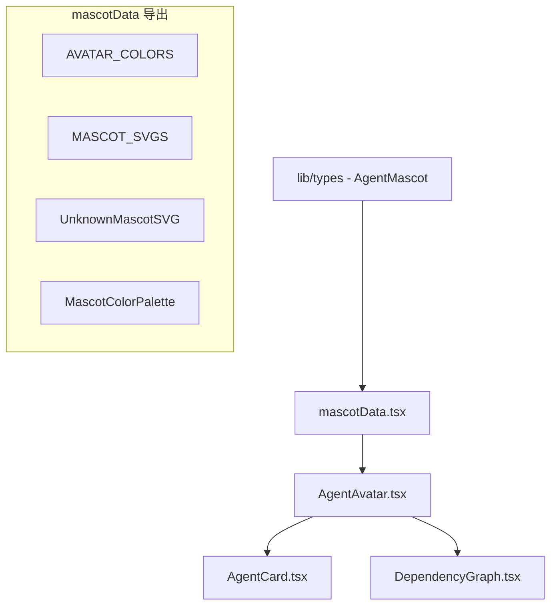

# `mascotData.tsx` -- Agent 吉祥物 SVG 定义与配色系统

> 源文件路径: `ui/src/components/mascotData.tsx`

## 功能概述

`mascotData.tsx` 定义了 AutoForge 中所有 Agent 吉祥物的 SVG 图形和配色方案。每个吉祥物是一个独立的 React SVG 组件，配合专属的颜色调色板，使多个 Agent 并行运行时能在视觉上清晰区分。

文件包含 20 个命名吉祥物（Spark、Fizz、Octo、Hoot、Buzz 等），以及一个用于未知 Agent 的兜底组件。吉祥物设计风格统一为简约可爱的 SVG 角色，涵盖机器人、狐狸、章鱼、猫头鹰、蜜蜂、火箭等多种形象。每个吉祥物的 SVG 尺寸基于 64x64 viewBox，支持任意缩放。

配色系统使用 `MascotColorPalette` 接口（primary/secondary/accent 三色），为每个吉祥物分配了独特的色调，确保在 Agent Mission Control 面板和依赖图节点上的辨识度。

## 依赖关系

### 导入依赖

| 模块 | 说明 |
|------|------|
| `../lib/types` | `AgentMascot` 类型 -- 吉祥物名称联合类型 |

### 被依赖

| 模块 | 引用内容 |
|------|----------|
| `ui/src/components/AgentAvatar.tsx` | 导入 `MASCOT_SVGS`, `AVATAR_COLORS`, `UNKNOWN_COLORS`, `UnknownMascotSVG` 等 |

## 关键组件/函数

### 类型定义

- **`MascotColorPalette`** -- 配色接口 `{ primary, secondary, accent }`
- **`MascotSVGProps`** -- SVG 组件 Props `{ colors: MascotColorPalette, size: number }`

### 配色常量

- **`UNKNOWN_COLORS`** -- 未知 Agent 的灰色调色板（`#6B7280` 系列）
- **`AVATAR_COLORS`** -- 20 个吉祥物的完整配色映射表

### SVG 组件（20 + 1 个）

| 组件 | 形象 | 主色调 |
|------|------|--------|
| `SparkSVG` | 蓝色机器人 | Blue (#3B82F6) |
| `FizzSVG` | 橙色狐狸 | Orange (#F97316) |
| `OctoSVG` | 紫色章鱼 | Violet (#8B5CF6) |
| `HootSVG` | 绿色猫头鹰 | Green (#22C55E) |
| `BuzzSVG` | 黄色蜜蜂 | Yellow (#EAB308) |
| `PixelSVG` | 粉色像素方块 | Pink (#EC4899) |
| `ByteSVG` | 青色 3D 立方体 | Cyan (#06B6D4) |
| `NovaSVG` | 玫瑰色星形 | Rose (#F43F5E) |
| `ChipSVG` | 绿黄色芯片 | Lime (#84CC16) |
| `BoltSVG` | 琥珀色闪电 | Amber (#FBBF24) |
| `DashSVG` | 青绿色飞弹 | Teal (#14B8A6) |
| `ZapSVG` | 紫罗兰色电球 | Violet (#A855F7) |
| `GizmoSVG` | 灰蓝色齿轮 | Slate (#64748B) |
| `TurboSVG` | 红色火箭 | Red (#EF4444) |
| `BlipSVG` | 翡翠色雷达点 | Emerald (#10B981) |
| `NeonSVG` | 品红色光球 | Fuchsia (#D946EF) |
| `WidgetSVG` | 靛蓝色窗口 | Indigo (#6366F1) |
| `ZippySVG` | 橙黄色兔子 | Orange-yellow (#F59E0B) |
| `QuirkSVG` | 天蓝色问号 | Sky (#0EA5E9) |
| `FluxSVG` | 深紫色波浪 | Purple (#7C3AED) |
| `UnknownSVG` | 灰色问号圆 | Gray (#6B7280) |

### 导出映射

- **`MASCOT_SVGS`** -- `Record<AgentMascot, React.FC<MascotSVGProps>>` 吉祥物组件查找表
- **`UnknownMascotSVG`** -- 单独导出的未知 Agent SVG 组件

## 架构图

## 注意事项

- 所有 SVG 基于 64x64 的 viewBox，通过 `size` prop 控制实际渲染尺寸
- 部分吉祥物使用 CSS `animate-pulse` 类实现动画效果（如 Spark 天线、Buzz 翅膀）
- `UnknownMascotSVG` 不在 `AgentMascot` 联合类型中，因此单独导出
- 配色方案经过精心选择，确保 20 个吉祥物在并行显示时有足够的色彩区分度
- 每个 SVG 组件都是纯函数组件，不包含状态管理
