# UI 基础组件库

> `ui/src/components/ui/` 目录包含基于 Radix UI 封装的 14 个基础组件，遵循 ShadCN 设计规范，为上层业务组件提供一致的、无障碍的 UI 原语。

## 目录结构

```
ui/
├── alert.tsx           # 警告提示
├── badge.tsx           # 徽章
├── button.tsx          # 按钮
├── card.tsx            # 卡片
├── checkbox.tsx        # 复选框
├── dialog.tsx          # 对话框
├── dropdown-menu.tsx   # 下拉菜单
├── input.tsx           # 输入框
├── label.tsx           # 标签
├── separator.tsx       # 分隔线
├── slider.tsx          # 滑动条
├── switch.tsx          # 开关
├── textarea.tsx        # 文本域
└── tooltip.tsx         # 工具提示
```

## 组件清单

| 组件 | 行数 | Radix 依赖 | 导出 | 说明 |
|------|------|------------|------|------|
| `button.tsx` | 64 | `@radix-ui/react-slot` | `Button`, `buttonVariants` | 按钮组件，支持 6 种变体和 8 种尺寸，通过 `asChild` 支持自定义元素 |
| `card.tsx` | 92 | 无 | `Card`, `CardHeader`, `CardFooter`, `CardTitle`, `CardAction`, `CardDescription`, `CardContent` | 卡片容器组合，7 个子组件 |
| `dialog.tsx` | 156 | `@radix-ui/react-dialog` | `Dialog`, `DialogTrigger`, `DialogContent`, `DialogHeader`, `DialogFooter`, `DialogTitle`, `DialogDescription`, `DialogOverlay`, `DialogPortal`, `DialogClose` | 模态对话框，支持动画过渡和关闭按钮控制 |
| `dropdown-menu.tsx` | 257 | `@radix-ui/react-dropdown-menu` | `DropdownMenu`, `DropdownMenuTrigger`, `DropdownMenuContent`, `DropdownMenuItem`, `DropdownMenuCheckboxItem`, `DropdownMenuRadioItem`, `DropdownMenuLabel`, `DropdownMenuSeparator`, `DropdownMenuGroup`, `DropdownMenuPortal`, `DropdownMenuSub`, `DropdownMenuSubContent`, `DropdownMenuSubTrigger`, `DropdownMenuRadioGroup` | 完整下拉菜单系统 |
| `tooltip.tsx` | 65 | `@radix-ui/react-tooltip` | `TooltipProvider`, `Tooltip`, `TooltipTrigger`, `TooltipContent` | 工具提示，动画进出 |
| `checkbox.tsx` | 30 | `@radix-ui/react-checkbox` | `Checkbox` | 复选框，带对勾指示器 |
| `switch.tsx` | 35 | `@radix-ui/react-switch` | `Switch` | 开关切换 |
| `label.tsx` | 22 | `@radix-ui/react-label` | `Label` | 表单标签 |
| `separator.tsx` | 28 | `@radix-ui/react-separator` | `Separator` | 水平/垂直分隔线 |
| `slider.tsx` | 44 | 无 (原生 HTML) | `Slider` | 滑动条，Radix Slider API 接口兼容 |
| `alert.tsx` | 66 | 无 | `Alert`, `AlertTitle`, `AlertDescription` | 警告提示，支持 default/destructive 变体 |
| `badge.tsx` | 48 | 无 | `Badge`, `badgeVariants` | 徽章，支持 4 种变体 |
| `input.tsx` | 21 | 无 | `Input` | 标准输入框封装 |
| `textarea.tsx` | 18 | 无 | `Textarea` | 标准文本域封装 |

## 变体详解

### Button 变体

**样式变体 (`variant`)**：

| 变体 | 样式说明 |
|------|----------|
| `default` | 主色背景，白色文字，悬停时降低不透明度 |
| `destructive` | 危险色背景，白色文字，焦点时红色环 |
| `outline` | 边框样式，透明背景，悬停时强调色背景 |
| `secondary` | 次要色背景，次要色文字 |
| `ghost` | 无背景，悬停时强调色背景 |
| `link` | 文本链接样式，悬停下划线 |

**尺寸变体 (`size`)**：

| 尺寸 | 高度 | 用途 |
|------|------|------|
| `default` | h-9 (36px) | 标准按钮 |
| `xs` | h-6 (24px) | 极小按钮 |
| `sm` | h-8 (32px) | 小型按钮 |
| `lg` | h-10 (40px) | 大型按钮 |
| `icon` | 36x36px | 图标按钮 |
| `icon-xs` | 24x24px | 极小图标按钮 |
| `icon-sm` | 32x32px | 小型图标按钮 |
| `icon-lg` | 40x40px | 大型图标按钮 |

### Badge 变体

| 变体 | 样式说明 |
|------|----------|
| `default` | 主色背景 |
| `secondary` | 次要色背景 |
| `destructive` | 危险色背景 |
| `outline` | 边框样式，透明背景 |

### Alert 变体

| 变体 | 样式说明 |
|------|----------|
| `default` | 标准背景色 |
| `destructive` | 危险色边框和文字 |

## Card 子组件

`Card` 采用组合模式，由 7 个子组件构成：

```
Card                    → 外层容器（圆角、边框、阴影）
├── CardHeader          → 头部区域（支持 CardAction 插槽）
│   ├── CardTitle       → 标题
│   ├── CardDescription → 描述
│   └── CardAction      → 操作区（右上角固定）
├── CardContent         → 内容区域
└── CardFooter          → 底部区域
```

## Dialog 子组件

`Dialog` 基于 Radix Dialog 原语，完整的模态对话框系统：

```
Dialog                  → 根容器（管理开/关状态）
├── DialogTrigger       → 触发器
└── DialogPortal        → Portal 传送门
    ├── DialogOverlay   → 背景遮罩（黑色 50% 半透明）
    └── DialogContent   → 内容容器（居中、动画、可关闭）
        ├── DialogHeader    → 头部
        │   ├── DialogTitle       → 标题
        │   └── DialogDescription → 描述
        ├── [自定义内容]
        ├── DialogFooter    → 底部（支持内置关闭按钮）
        └── DialogClose     → 关闭按钮（右上角 X）
```

`DialogContent` 支持 `showCloseButton` prop 控制是否显示关闭按钮（默认显示）。

## 架构图

```mermaid
graph TB
    subgraph "Radix UI 原语"
        RadixDialog["@radix-ui/react-dialog"]
        RadixDropdown["@radix-ui/react-dropdown-menu"]
        RadixTooltip["@radix-ui/react-tooltip"]
        RadixCheckbox["@radix-ui/react-checkbox"]
        RadixSwitch["@radix-ui/react-switch"]
        RadixLabel["@radix-ui/react-label"]
        RadixSeparator["@radix-ui/react-separator"]
        RadixSlot["@radix-ui/react-slot"]
    end

    subgraph "样式工具"
        CVA["class-variance-authority<br/>变体定义"]
        CN["cn() = clsx + tailwind-merge<br/>样式合并"]
        Lucide["lucide-react<br/>图标 (XIcon, CheckIcon, ChevronIcon)"]
    end

    subgraph "UI 基础组件"
        Dialog["dialog.tsx<br/>10 个导出"]
        Dropdown["dropdown-menu.tsx<br/>14 个导出"]
        Tooltip["tooltip.tsx<br/>4 个导出"]
        Checkbox["checkbox.tsx"]
        Switch["switch.tsx"]
        Label["label.tsx"]
        Separator["separator.tsx"]
        Slider["slider.tsx"]
        BtnComp["button.tsx<br/>6 变体 x 8 尺寸"]
        CardComp["card.tsx<br/>7 个子组件"]
        AlertComp["alert.tsx<br/>2 变体"]
        BadgeComp["badge.tsx<br/>4 变体"]
        InputComp["input.tsx"]
        TextareaComp["textarea.tsx"]
    end

    subgraph "业务组件 (使用方)"
        FeatureModal["FeatureModal"]
        SettingsModal["SettingsModal"]
        AgentControl["AgentControl"]
        ScheduleModal["ScheduleModal"]
        DebugLogViewer["DebugLogViewer"]
        Others["其他 40+ 组件"]
    end

    RadixDialog --> Dialog
    RadixDropdown --> Dropdown
    RadixTooltip --> Tooltip
    RadixCheckbox --> Checkbox
    RadixSwitch --> Switch
    RadixLabel --> Label
    RadixSeparator --> Separator
    RadixSlot --> BtnComp

    CVA --> BtnComp
    CVA --> BadgeComp
    CVA --> AlertComp
    CN --> BtnComp
    CN --> CardComp
    CN --> Dialog
    CN --> Dropdown
    Lucide --> Dialog

    Dialog --> FeatureModal
    Dialog --> SettingsModal
    Dialog --> ScheduleModal
    BtnComp --> AgentControl
    BtnComp --> SettingsModal
    CardComp --> DebugLogViewer
    Tooltip --> Others
    Checkbox --> SettingsModal
    Switch --> SettingsModal
    Slider --> SettingsModal
```



## 依赖关系

### 外部依赖

| 库 | 版本 | 使用组件 |
|----|------|----------|
| `@radix-ui/react-dialog` | ^1.1.15 | dialog.tsx |
| `@radix-ui/react-dropdown-menu` | ^2.1.16 | dropdown-menu.tsx |
| `@radix-ui/react-tooltip` | ^1.2.8 | tooltip.tsx |
| `@radix-ui/react-checkbox` | ^1.3.3 | checkbox.tsx |
| `@radix-ui/react-switch` | ^1.2.6 | switch.tsx |
| `@radix-ui/react-label` | ^2.1.8 | label.tsx |
| `@radix-ui/react-separator` | ^1.1.8 | separator.tsx |
| `@radix-ui/react-slot` | ^1.2.4 | button.tsx |
| `class-variance-authority` | ^0.7.1 | button.tsx, badge.tsx, alert.tsx |
| `lucide-react` | ^0.475.0 | dialog.tsx, dropdown-menu.tsx |

### 内部依赖

所有组件统一使用 `@/lib/utils` 中的 `cn()` 函数进行样式合并。

## 关键模式

1. **ShadCN 封装模式**: 每个组件在 Radix 原语基础上添加 Tailwind CSS 样式，通过 `cn()` 支持外部 `className` 覆盖
2. **data-slot 标记**: 所有组件输出的 DOM 节点标记 `data-slot` 属性，便于样式选择器和测试定位
3. **变体系统**: 使用 `class-variance-authority` (CVA) 定义类型安全的变体映射，避免条件样式的硬编码
4. **组合模式**: Card、Dialog 等复杂组件采用子组件组合方式，每个子组件独立导出，使用方自由组装
5. **Slot 透传**: Button 通过 `asChild` prop 使用 Radix Slot，允许将按钮样式应用到任意子元素（如 Link）
6. **无障碍**: 所有交互组件继承 Radix UI 的完整无障碍支持（键盘导航、ARIA 属性、焦点管理）
