# 自定义 React Hooks

> `ui/src/hooks/` 目录包含 10 个自定义 React Hooks，封装了 WebSocket 通信、数据获取、主题管理、音效系统和聊天交互等核心逻辑。

## 目录结构

```
hooks/
├── useWebSocket.ts         # WebSocket 连接与实时状态管理
├── useProjects.ts          # TanStack Query 数据获取 Hooks
├── useTheme.ts             # 主题切换与暗色模式管理
├── useCelebration.ts       # 全部完成庆祝效果
├── useFeatureSound.ts      # 特性状态变更音效
├── useSpecChat.ts          # Spec 创建 WebSocket 聊天
├── useExpandChat.ts        # 项目扩展 WebSocket 聊天
├── useAssistantChat.ts     # AI 助手 WebSocket 聊天
├── useConversations.ts     # 助手对话历史 CRUD
└── useSchedules.ts         # 定时调度 CRUD
```

## Hook 清单

| Hook | 行数 | 类型 | 说明 |
|------|------|------|------|
| `useWebSocket.ts` | 484 | 实时通信 | WebSocket 连接管理，接收 9 种消息类型，管理进度/Agent/日志/编排器状态 |
| `useProjects.ts` | 415 | 数据获取 | TanStack Query 封装，30+ 个 Query/Mutation Hooks |
| `useSpecChat.ts` | 474 | 聊天 | Spec 创建 WebSocket 聊天，图片上传，问题交互 |
| `useAssistantChat.ts` | 425 | 聊天 | AI 助手 WebSocket 聊天，会话管理，工具调用 |
| `useExpandChat.ts` | 349 | 聊天 | 项目扩展 WebSocket 聊天，批量特性创建 |
| `useCelebration.ts` | 185 | 副作用 | 全部特性完成时触发彩纸 + 号角音效 |
| `useTheme.ts` | 148 | 状态管理 | 6 主题 + 暗色模式切换，localStorage 持久化 |
| `useSchedules.ts` | 112 | 数据获取 | 定时调度 CRUD 及下次运行查询 |
| `useFeatureSound.ts` | 109 | 副作用 | 特性列转移时播放提示音 |
| `useConversations.ts` | 58 | 数据获取 | 助手对话列表查询与删除 |

## 详细说明

### useWebSocket.ts

`useProjectWebSocket(projectName: string | null)` -- 项目级 WebSocket 连接管理。

**返回值**：

| 字段 | 类型 | 说明 |
|------|------|------|
| `progress` | `{passing, in_progress, needs_human_input, total, percentage}` | 实时进度 |
| `agentStatus` | `AgentStatus` | Agent 运行状态 |
| `logs` | `Array<{line, timestamp, featureId?, agentIndex?}>` | 全局日志（最多 100 条） |
| `isConnected` | `boolean` | WebSocket 连接状态 |
| `devServerStatus` | `DevServerStatus` | 开发服务器状态 |
| `devServerUrl` | `string \| null` | 开发服务器 URL |
| `devLogs` | `Array<{line, timestamp}>` | 开发服务器日志（最多 100 条） |
| `activeAgents` | `ActiveAgent[]` | 当前活跃的 Agent 列表 |
| `recentActivity` | `ActivityItem[]` | 最近活动列表（最多 20 条） |
| `orchestratorStatus` | `OrchestratorStatus \| null` | 编排器状态 |
| `celebration` | `CelebrationTrigger \| null` | 当前庆祝触发 |
| `clearLogs` | `() => void` | 清空全局日志 |
| `clearDevLogs` | `() => void` | 清空开发服务器日志 |
| `clearCelebration` | `() => void` | 清除庆祝并显示队列下一个 |
| `getAgentLogs` | `(agentIndex: number) => AgentLogEntry[]` | 获取指定 Agent 的日志 |
| `clearAgentLogs` | `(agentIndex: number) => void` | 清空指定 Agent 的日志 |

**核心特性**：
- 指数退避重连（1s 起步，最长 30s），应用错误（4xxx）不重连
- 30 秒心跳 Ping 保持连接
- 每分钟清理超过 30 分钟无更新的过期 Agent
- 庆祝队列机制：快速连续成功时排队显示，避免竞态条件
- 项目切换时完全重置状态
- 按 Agent 分离日志存储（每个 Agent 最多 500 条）

**处理的消息类型**：

| 消息类型 | 处理逻辑 |
|----------|----------|
| `progress` | 更新进度数据 |
| `agent_status` | 更新 Agent 状态，stopped/crashed 时清空活跃列表 |
| `log` | 追加全局日志 + Agent 分属日志 |
| `agent_update` | 更新/添加/移除 Agent，维护活动流和庆祝队列 |
| `orchestrator_update` | 更新编排器状态和最近事件 |
| `dev_log` | 追加开发服务器日志 |
| `dev_server_status` | 更新开发服务器状态和 URL |
| `feature_update` | 特性更新（由 React Query 处理刷新） |
| `pong` | 心跳响应（忽略） |

---

### useProjects.ts

基于 TanStack Query 的完整数据获取层，涵盖项目、特性、Agent、设置等所有 REST API。

**项目相关**：

| Hook | 类型 | 说明 |
|------|------|------|
| `useProjects()` | Query | 获取项目列表 |
| `useProject(name)` | Query | 获取单个项目详情 |
| `useCreateProject()` | Mutation | 创建项目 |
| `useDeleteProject()` | Mutation | 删除项目 |
| `useResetProject(projectName)` | Mutation | 重置项目 |
| `useUpdateProjectSettings(projectName)` | Mutation | 更新项目设置 |

**特性相关**：

| Hook | 类型 | 刷新间隔 | 说明 |
|------|------|----------|------|
| `useFeatures(projectName)` | Query | 5s | 获取按状态分组的特性列表 |
| `useCreateFeature(projectName)` | Mutation | - | 创建特性 |
| `useDeleteFeature(projectName)` | Mutation | - | 删除特性 |
| `useSkipFeature(projectName)` | Mutation | - | 跳过特性 |
| `useUpdateFeature(projectName)` | Mutation | - | 更新特性 |
| `useResolveHumanInput(projectName)` | Mutation | - | 提交人工输入 |

**Agent 相关**：

| Hook | 类型 | 说明 |
|------|------|------|
| `useAgentStatus(projectName)` | Query (3s 轮询) | Agent 运行状态 |
| `useStartAgent(projectName)` | Mutation | 启动 Agent |
| `useStopAgent(projectName)` | Mutation | 停止 Agent |
| `usePauseAgent(projectName)` | Mutation | 暂停 Agent |
| `useResumeAgent(projectName)` | Mutation | 恢复 Agent |
| `useGracefulPauseAgent(projectName)` | Mutation | 优雅暂停 |
| `useGracefulResumeAgent(projectName)` | Mutation | 优雅恢复 |

**设置相关**：

| Hook | 类型 | 缓存时间 | 说明 |
|------|------|----------|------|
| `useSettings()` | Query | 60s | 获取全局设置 |
| `useUpdateSettings()` | Mutation | - | 更新设置（乐观更新 + 错误回滚） |
| `useAvailableModels()` | Query | 300s | 获取可用模型列表 |
| `useAvailableProviders()` | Query | 300s | 获取可用 API 提供商 |

**其他**：

| Hook | 类型 | 说明 |
|------|------|------|
| `useSetupStatus()` | Query (60s 缓存) | 环境检查状态 |
| `useHealthCheck()` | Query (不重试) | 健康检查 |
| `useListDirectory(path?)` | Query | 文件系统列表 |
| `useCreateDirectory()` | Mutation | 创建目录 |
| `useValidatePath()` | Mutation | 路径验证 |
| `useDevServerConfig(projectName)` | Query (30s 缓存) | 开发服务器配置 |
| `useUpdateDevServerConfig(projectName)` | Mutation | 更新开发服务器配置 |

**乐观更新模式**（`useUpdateSettings`）：
1. `onMutate`: 取消进行中的查询，快照当前值，乐观写入新值
2. `onError`: 回滚到快照值
3. `onSettled`: 无论成功失败，刷新缓存

---

### useTheme.ts

`useTheme()` -- 主题和暗色模式管理。

**返回值**：

| 字段 | 类型 | 说明 |
|------|------|------|
| `theme` | `ThemeId` | 当前主题 ID |
| `setTheme` | `(theme: ThemeId) => void` | 设置主题 |
| `darkMode` | `boolean` | 暗色模式状态 |
| `setDarkMode` | `(enabled: boolean) => void` | 设置暗色模式 |
| `toggleDarkMode` | `() => void` | 切换暗色模式 |
| `themes` | `ThemeOption[]` | 所有主题列表 |
| `currentTheme` | `ThemeOption` | 当前主题对象 |

**支持的主题**：

| ID | 名称 | 描述 |
|----|------|------|
| `twitter` | Twitter | 清爽现代的蓝色设计（默认） |
| `claude` | Claude | 温暖米色调配橙色强调 |
| `neo-brutalism` | Neo Brutalism | 硬阴影粗线条风格 |
| `retro-arcade` | Retro Arcade | 鲜艳粉青像素风 |
| `aurora` | Aurora | 紫色青色极光渐变 |
| `business` | Business | 深海蓝灰色商务风 |

通过在 `<html>` 元素上添加/移除 CSS 类名（如 `theme-claude`, `dark`）实现零运行时主题切换。

---

### useCelebration.ts

`useCelebration(features, projectName)` -- 当所有特性完成时触发庆祝效果。

**行为**：
- 全部特性 done（pending=0, in_progress=0, needs_human_input=0, done>0）时触发
- 首次加载已完成项目不触发（防止页面刷新时误触发）
- 按项目追踪已庆祝状态，同一项目只庆祝一次
- 触发内容：双侧彩纸喷射（canvas-confetti）+ C 大调号角音效（Web Audio API）

---

### useFeatureSound.ts

`useFeatureSound(features)` -- 特性状态变更时播放提示音。

**音效映射**：

| 转移 | 音效 | 频率 |
|------|------|------|
| pending → in_progress | 上行双音 | C5(523Hz) → E5(659Hz) |
| in_progress/pending → done | 上行三音琶音 | C5 → E5 → G5(784Hz) |

使用 Web Audio API 生成正弦波音，首次加载不播放，多个特性同时移动只播放一次。

---

### useSpecChat.ts

`useSpecChat(projectName)` -- Spec 创建 WebSocket 聊天管理。

**功能**：
- 建立 `/ws/spec/create/{projectName}` WebSocket 连接
- 处理文本/问题/完成/文件写入/错误等消息类型
- 支持发送文本消息和图片附件（base64 编码）
- 管理消息列表和流式响应状态
- 心跳保活（30 秒间隔）

---

### useExpandChat.ts

`useExpandChat(projectName)` -- 项目扩展 WebSocket 聊天管理。

**功能**：
- 建立 `/ws/expand/{projectName}` WebSocket 连接
- 处理文本/特性创建/扩展完成等消息类型
- 跟踪新创建的特性列表
- 接口与 useSpecChat 类似

---

### useAssistantChat.ts

`useAssistantChat(projectName, conversationId)` -- AI 助手 WebSocket 聊天管理。

**功能**：
- 建立 `/ws/assistant/{projectName}` WebSocket 连接
- 支持新建/续接对话
- 处理文本/工具调用/问题/会话创建/错误等消息类型
- 工具调用显示（只读，不执行）
- 跟踪创建的 conversationId

---

### useConversations.ts

助手对话历史管理 Hooks。

| Hook | 类型 | 说明 |
|------|------|------|
| `useConversations(projectName)` | Query (30s 缓存) | 获取对话列表 |
| `useConversation(projectName, id)` | Query (30s 缓存) | 获取单个对话详情（404 不重试） |
| `useDeleteConversation(projectName)` | Mutation | 删除对话 |

---

### useSchedules.ts

定时调度管理 Hooks。

| Hook | 类型 | 说明 |
|------|------|------|
| `useSchedules(projectName)` | Query | 获取调度列表 |
| `useSchedule(projectName, id)` | Query | 获取单个调度 |
| `useCreateSchedule(projectName)` | Mutation | 创建调度 |
| `useUpdateSchedule(projectName)` | Mutation | 更新调度 |
| `useDeleteSchedule(projectName)` | Mutation | 删除调度 |
| `useToggleSchedule(projectName)` | Mutation | 切换调度启停 |
| `useNextScheduledRun(projectName)` | Query (30s 轮询) | 获取下次运行时间 |

## 依赖关系图

```mermaid
graph TB
    subgraph "React 核心"
        useState["useState"]
        useEffect["useEffect"]
        useRef["useRef"]
        useCallback["useCallback"]
    end

    subgraph "外部库"
        TQ["@tanstack/react-query<br/>useQuery / useMutation"]
        Confetti["canvas-confetti"]
        WebAudio["Web Audio API"]
        WS["WebSocket API"]
    end

    subgraph "内部模块"
        API["lib/api.ts<br/>REST 客户端"]
        Types["lib/types.ts<br/>类型定义"]
    end

    subgraph "hooks/"
        useWebSocket["useWebSocket<br/>484 行"]
        useProjects["useProjects<br/>415 行"]
        useSpecChat["useSpecChat<br/>474 行"]
        useAssistantChat["useAssistantChat<br/>425 行"]
        useExpandChat["useExpandChat<br/>349 行"]
        useCelebration["useCelebration<br/>185 行"]
        useTheme["useTheme<br/>148 行"]
        useSchedules["useSchedules<br/>112 行"]
        useFeatureSound["useFeatureSound<br/>109 行"]
        useConversations["useConversations<br/>58 行"]
    end

    subgraph "使用方"
        App["App.tsx"]
        Components["业务组件"]
    end

    useWebSocket --> WS
    useWebSocket --> useState
    useWebSocket --> useEffect
    useWebSocket --> useRef
    useWebSocket --> useCallback
    useWebSocket --> Types

    useProjects --> TQ
    useProjects --> API
    useProjects --> Types

    useSpecChat --> WS
    useSpecChat --> Types
    useAssistantChat --> WS
    useAssistantChat --> Types
    useExpandChat --> WS
    useExpandChat --> Types

    useCelebration --> Confetti
    useCelebration --> WebAudio
    useCelebration --> Types
    useFeatureSound --> WebAudio
    useFeatureSound --> Types

    useTheme --> useState
    useTheme --> useEffect

    useSchedules --> TQ
    useSchedules --> API
    useSchedules --> Types
    useConversations --> TQ
    useConversations --> API

    App --> useWebSocket
    App --> useProjects
    App --> useTheme
    App --> useCelebration
    App --> useFeatureSound
    Components --> useSpecChat
    Components --> useAssistantChat
    Components --> useExpandChat
    Components --> useSchedules
    Components --> useConversations
```



## 关键模式

1. **WebSocket + Query 双通道**: `useWebSocket` 处理推送的实时数据（进度/日志/状态），`useProjects` 管理 REST API 的可轮询数据，两者互不干扰
2. **副作用 Hook**: `useCelebration` 和 `useFeatureSound` 是纯副作用 Hook（无返回值），仅响应数据变化触发音效
3. **首次加载保护**: 音效和庆祝 Hook 都跳过初始加载时的触发，仅响应实际的状态变更
4. **乐观更新**: `useUpdateSettings` 使用 TanStack Query 的乐观更新机制，提升 UI 响应速度
5. **聊天 Hook 一致性**: 三个聊天 Hook（Spec/Expand/Assistant）共享相似架构：WebSocket 连接 + 消息管理 + 心跳保活 + 错误处理
6. **缓存策略分层**: 频繁变化的数据（特性 5s、Agent 3s）短缓存高频轮询；稳定数据（模型 300s、设置 60s）长缓存低频刷新
