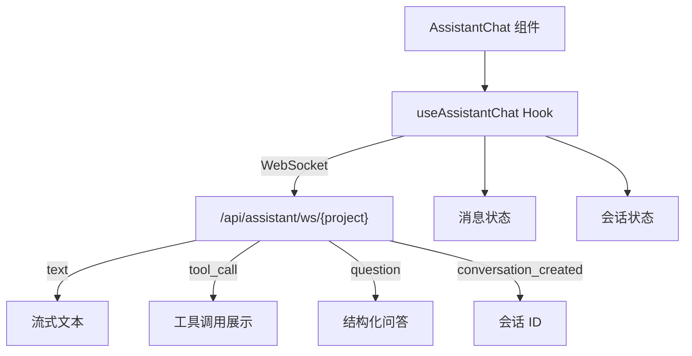

# `useAssistantChat.ts` -- AI 助手聊天 WebSocket Hook

> 源文件路径: `ui/src/hooks/useAssistantChat.ts`

## 功能概述

`useAssistantChat.ts` 提供 `useAssistantChat` 自定义 Hook，管理项目 AI 助手的 WebSocket 聊天连接。它支持用户与 Claude Agent 进行只读（不修改代码）的项目问答对话，帮助用户理解项目结构和回答技术问题。

该 Hook 管理聊天会话的完整生命周期：WebSocket 连接建立、消息发送与接收、流式文本渲染、工具调用展示（Tool Call 转换为用户可读描述）、结构化问答、会话 ID 管理，以及历史对话恢复。与 `useSpecChat` 不同，此 Hook 支持多会话管理和会话持久化。

Hook 内置了连接管理（防止重复连接）、心跳保活（30 秒）、指数退避重连（最多 3 次）和资源清理等机制。

## 依赖关系

### 导入依赖

| 模块 | 说明 |
|------|------|
| `react` | useState, useCallback, useRef, useEffect |
| `../lib/types` | ChatMessage, AssistantChatServerMessage, SpecQuestion 类型 |

### 被依赖

| 模块 | 引用内容 |
|------|----------|
| `ui/src/components/AssistantChat.tsx` | `useAssistantChat` -- AI 助手聊天组件 |

## 关键类/函数

### `useAssistantChat(options: UseAssistantChatOptions): UseAssistantChatReturn`

- 参数:
  - `projectName: string` -- 项目名称
  - `onError?: (error: string) => void` -- 错误回调
- 返回值:
  - `messages: ChatMessage[]` -- 聊天消息列表
  - `isLoading: boolean` -- 是否正在等待响应
  - `connectionStatus: ConnectionStatus` -- 连接状态
  - `conversationId: number | null` -- 当前会话 ID
  - `currentQuestions: SpecQuestion[] | null` -- 当前结构化问题
  - `start(conversationId?)` -- 启动连接（可恢复已有会话）
  - `sendMessage(content)` -- 发送用户消息
  - `sendAnswer(answers)` -- 发送结构化问答答案
  - `disconnect()` -- 断开连接
  - `clearMessages()` -- 清空消息列表

### WebSocket 消息处理

| 消息类型 | 处理逻辑 |
|----------|----------|
| `text` | 追加到流式助手消息或创建新消息 |
| `tool_call` | 转换为用户可读描述并显示为系统消息 |
| `question` | 设置结构化问题，附加到最后一条助手消息 |
| `conversation_created` | 保存新创建的会话 ID |
| `response_done` | 标记消息流式结束，停止加载 |
| `error` | 显示错误系统消息 |
| `pong` | 心跳响应 |

### 工具调用可读化映射

| 工具名称 | 显示描述 |
|----------|----------|
| `mcp__features__feature_create` | "Creating feature: {name} in {category}" |
| `mcp__features__feature_create_bulk` | "Creating N features" |
| `mcp__features__feature_skip` | "Skipping feature" |
| `mcp__features__feature_get_stats` | "Checking project progress" |
| `Read` | "Reading file: {filename}" |
| `Glob` | "Searching for files: {pattern}" |
| `Grep` | "Searching for: {pattern}" |

## 架构图

## 注意事项

- `start()` 方法支持传入 `existingConversationId` 参数来恢复历史会话，此时会设置 conversationId 并发送给服务端。
- `connect()` 方法会检查当前连接状态，防止在 `OPEN` 或 `CONNECTING` 状态下重复创建连接。
- 工具调用（`tool_call`）消息会被转换为用户友好的描述文本，如 "Reading file: App.tsx"，而非显示原始工具名称。
- `clearMessages()` 只清空消息列表，不重置 `conversationId`，因为会话切换由 `start()` 处理。
- 开发环境下（`import.meta.env.DEV`）会输出 WebSocket 消息的调试日志。
- `checkAndSendTimeoutRef` 用于防止 `start()` 被多次调用时累积未清理的定时器。
