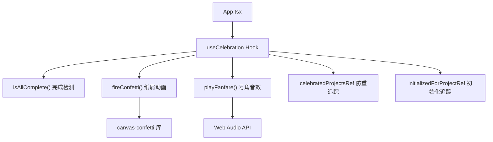

# `useCelebration.ts` -- 全部功能完成庆祝效果 Hook

> 源文件路径: `ui/src/hooks/useCelebration.ts`

## 功能概述

`useCelebration.ts` 提供 `useCelebration` 自定义 Hook，在项目的所有功能全部完成时触发庆祝效果。庆祝效果包含两部分：屏幕两侧的彩色纸屑（confetti）爆发动画和使用 Web Audio API 合成的胜利号角音效。

该文件包含三个核心函数：`playFanfare()` 播放由 C 大调琶音（C5-E5-G5-C6）和最终和弦组成的胜利号角音效；`fireConfetti()` 从屏幕两侧发射多轮彩色纸屑；`isAllComplete()` 检查是否所有功能都已完成。

Hook 实现了精巧的防重触发机制：通过 `celebratedProjectsRef` 跟踪已庆祝的项目，通过 `initializedForProjectRef` 避免在首次加载已完成项目时触发庆祝（只在状态从未完成变为完成时触发）。

## 依赖关系

### 导入依赖

| 模块 | 说明 |
|------|------|
| `react` | useEffect, useRef |
| `canvas-confetti` | confetti 纸屑动画库 |
| `../lib/types` | FeatureListResponse 类型 |

### 被依赖

| 模块 | 引用内容 |
|------|----------|
| `ui/src/App.tsx` | `useCelebration` -- 在主组件中监听功能完成状态 |

## 关键类/函数

### `useCelebration(features: FeatureListResponse | undefined, projectName: string | null): void`

- 参数:
  - `features` -- 当前项目的功能列表响应
  - `projectName` -- 当前选中的项目名
- 返回值: void
- 说明: 监听功能数据变化，在所有功能完成时触发庆祝

### `playFanfare(): void`

- 说明: 使用 Web Audio API 播放胜利号角音效
- 音符序列: C5(523Hz) -> E5(659Hz) -> G5(784Hz) -> C6(1047Hz)，间隔 0.15 秒
- 最终和弦: C 大调四音和弦，0.5 秒持续
- 音色: 正弦波（sine），带包络（淡入淡出）
- 容错: 捕获所有异常，Audio API 不支持时静默失败

### `fireConfetti(): void`

- 说明: 从屏幕左右两侧发射纸屑动画，持续 2 秒
- 初始爆发: 每侧 100 粒纸屑，扩散角 70 度
- 持续发射: 每 250 毫秒每侧 30 粒纸屑
- 颜色: `['#ff6b6b', '#4ecdc4', '#45b7d1', '#96ceb4', '#ffeaa7', '#dfe6e9']`

### `isAllComplete(features: FeatureListResponse | undefined): boolean`

- 参数: `features` -- 功能列表响应
- 返回值: 当 pending=0, in_progress=0, needs_human_input=0, done>0 时返回 true

## 架构图

## 注意事项

- 首次加载已完成的项目不会触发庆祝（通过 `initializedForProjectRef` 判断），避免每次刷新页面都触发。
- 庆祝在每个项目每次会话中只触发一次，通过 `celebratedProjectsRef`（Set）跟踪。
- 切换到不同的已完成项目时，如果该项目尚未庆祝过，会在第二次数据更新时触发（首次标记为已初始化）。
- Web Audio API 在某些浏览器中可能需要用户交互后才能播放声音（autoplay 策略），此处通过 try-catch 静默处理。
- AudioContext 在音效播放完毕后 1.5 秒自动关闭，释放系统资源。
- 此 Hook 处理的是"所有功能完成"的全局庆祝，与 WebSocket 中的单个功能完成庆祝（`CelebrationOverlay`）是不同的机制。
