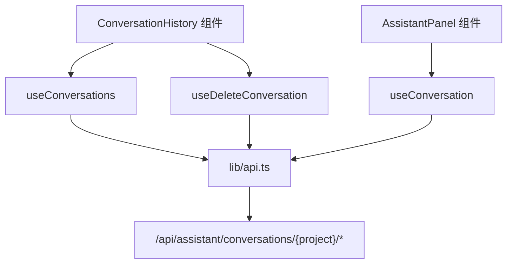

# `useConversations.ts` -- 助手对话管理 React Query Hooks

> 源文件路径: `ui/src/hooks/useConversations.ts`

## 功能概述

`useConversations.ts` 提供一组基于 TanStack React Query 的自定义 Hooks，封装了 AI 助手对话历史的管理功能。助手支持多会话，用户可以查看历史对话列表、恢复某个对话、或删除不需要的对话。

该文件包含三个 Hooks：列出项目的所有对话、获取单个对话的完整消息列表、删除对话。查询 Hooks 配置了 30 秒的缓存时间，删除操作在成功后会同时使列表缓存失效并移除特定对话的缓存。

## 依赖关系

### 导入依赖

| 模块 | 说明 |
|------|------|
| `@tanstack/react-query` | useQuery, useMutation, useQueryClient |
| `../lib/api` | listAssistantConversations, getAssistantConversation, deleteAssistantConversation |

### 被依赖

| 模块 | 引用内容 |
|------|----------|
| `ui/src/components/ConversationHistory.tsx` | `useConversations`, `useDeleteConversation` -- 对话列表组件 |
| `ui/src/components/AssistantPanel.tsx` | `useConversation` -- 加载特定对话内容 |

## 关键类/函数

### `useConversations(projectName: string | null)`

- 参数: `projectName` -- 项目名，null 时禁用查询
- 缓存键: `['conversations', projectName]`
- `staleTime`: 30000 (30 秒)
- 返回值: `UseQueryResult<AssistantConversation[]>`
- 说明: 获取项目的所有助手对话列表

### `useConversation(projectName: string | null, conversationId: number | null)`

- 参数: `projectName`, `conversationId` -- 两者都非空时启用查询
- 缓存键: `['conversation', projectName, conversationId]`
- `staleTime`: 30000 (30 秒)
- 重试策略: 404 错误不重试，其他错误最多重试 3 次
- 返回值: `UseQueryResult<AssistantConversationDetail>`
- 说明: 获取单个对话的完整消息列表

### `useDeleteConversation(projectName: string)`

- 参数: `projectName` -- 项目名
- Mutation 输入: `conversationId: number`
- 成功回调:
  - 使 `['conversations', projectName]` 缓存失效
  - 使用 `removeQueries` 移除 `['conversation', projectName, deletedId]` 缓存
- 说明: 删除指定对话

## 架构图

## 注意事项

- `useConversation` 对 404 错误有特殊处理：当对话不存在时不进行重试，因为这种情况不会自行恢复。
- `useDeleteConversation` 使用 `removeQueries`（而非 `invalidateQueries`）清除被删除对话的缓存，因为该对话不再存在，无需重新请求。
- 30 秒的 `staleTime` 在助手面板打开期间提供了合理的缓存平衡：避免过于频繁的请求，同时保持数据相对新鲜。
- 对话列表按照后端返回的顺序排列（通常是按更新时间倒序），排序逻辑在服务端完成。
