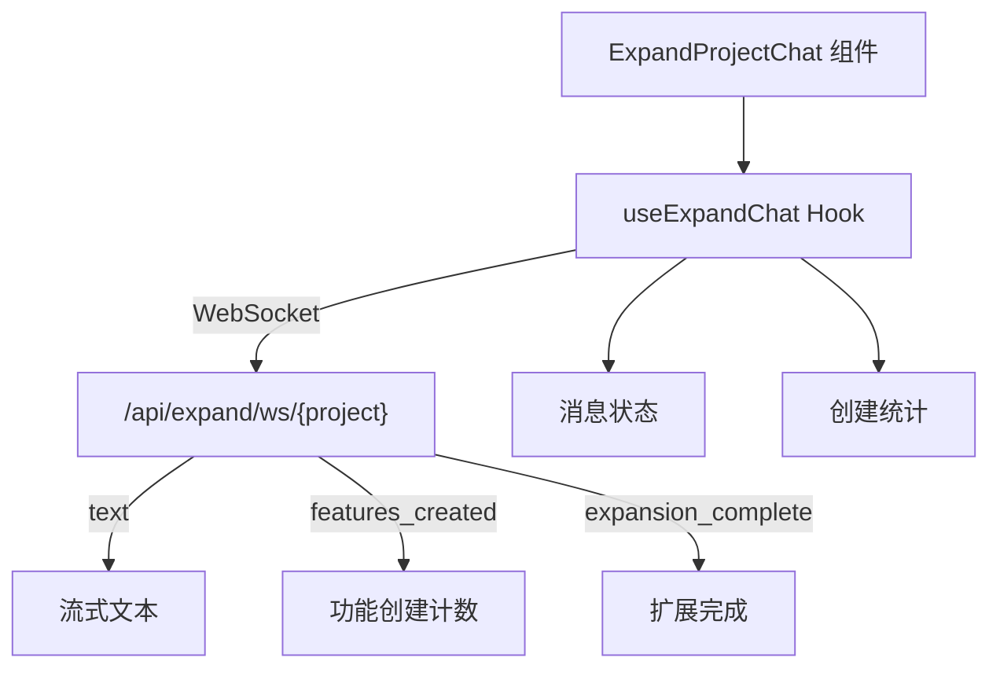

# `useExpandChat.ts` -- 项目扩展聊天 WebSocket Hook

> 源文件路径: `ui/src/hooks/useExpandChat.ts`

## 功能概述

`useExpandChat.ts` 提供 `useExpandChat` 自定义 Hook，管理通过自然语言扩展项目功能的 WebSocket 聊天连接。它允许用户通过 AI 对话的方式批量添加新功能到已有项目中。

该 Hook 管理扩展聊天的完整生命周期：WebSocket 连接建立、消息发送（支持图片附件）、流式文本接收、功能创建计数跟踪、扩展完成回调。与 `useSpecChat` 类似但专注于项目扩展场景，跟踪已创建的功能数量和最近创建的功能列表。

Hook 内置了手动断开标记（`manuallyDisconnectedRef`）防止断开后自动重连、连接超时保护（最多等待 5 秒）、指数退避重连（最多 3 次）等机制。

## 依赖关系

### 导入依赖

| 模块 | 说明 |
|------|------|
| `react` | useState, useCallback, useRef, useEffect |
| `../lib/types` | ChatMessage, ImageAttachment, ExpandChatServerMessage 类型 |

### 被依赖

| 模块 | 引用内容 |
|------|----------|
| `ui/src/components/ExpandProjectChat.tsx` | `useExpandChat` -- 项目扩展聊天组件 |

## 关键类/函数

### `useExpandChat(options: UseExpandChatOptions): UseExpandChatReturn`

- 参数:
  - `projectName: string` -- 项目名称
  - `onComplete?: (totalAdded: number) => void` -- 扩展完成回调
  - `onError?: (error: string) => void` -- 错误回调
- 返回值:
  - `messages: ChatMessage[]` -- 聊天消息列表
  - `isLoading: boolean` -- 是否正在等待响应
  - `isComplete: boolean` -- 扩展是否完成
  - `connectionStatus: ConnectionStatus` -- 连接状态
  - `featuresCreated: number` -- 已创建的功能总数
  - `recentFeatures: CreatedFeature[]` -- 最近创建的功能列表（id, name, category）
  - `start()` -- 启动聊天连接
  - `sendMessage(content, attachments?)` -- 发送消息（支持图片附件）
  - `disconnect()` -- 断开连接

### WebSocket 消息处理

| 消息类型 | 处理逻辑 |
|----------|----------|
| `text` | 追加到流式助手消息或创建新消息 |
| `features_created` | 累加功能计数，更新最近功能列表，添加系统消息 |
| `expansion_complete` | 标记完成，调用 `onComplete` 回调 |
| `error` | 显示错误系统消息 |
| `response_done` | 标记消息流式结束 |
| `pong` | 心跳响应 |

### `CreatedFeature` 接口

```typescript
interface CreatedFeature {
  id: number
  name: string
  category: string
}
```

## 架构图



## 注意事项

- 与 `useSpecChat` 不同，扩展完成时**会**调用 `onComplete` 回调，因为扩展完成后需要刷新 Kanban 看板。
- `disconnect()` 设置 `manuallyDisconnectedRef.current = true`，防止 `onclose` 处理器触发自动重连。
- `start()` 中的连接等待有 50 次（5 秒）的超时保护，超时后会调用 `onError` 回调。
- 图片附件在发送时只传输 `filename`、`mimeType` 和 `base64Data`，不传输 `previewUrl`。
- `featuresCreated` 使用累加计数，支持多轮对话中的增量功能创建。
- `recentFeatures` 每次 `features_created` 消息时会被完全替换（而非追加），只保留最近一批创建的功能。
