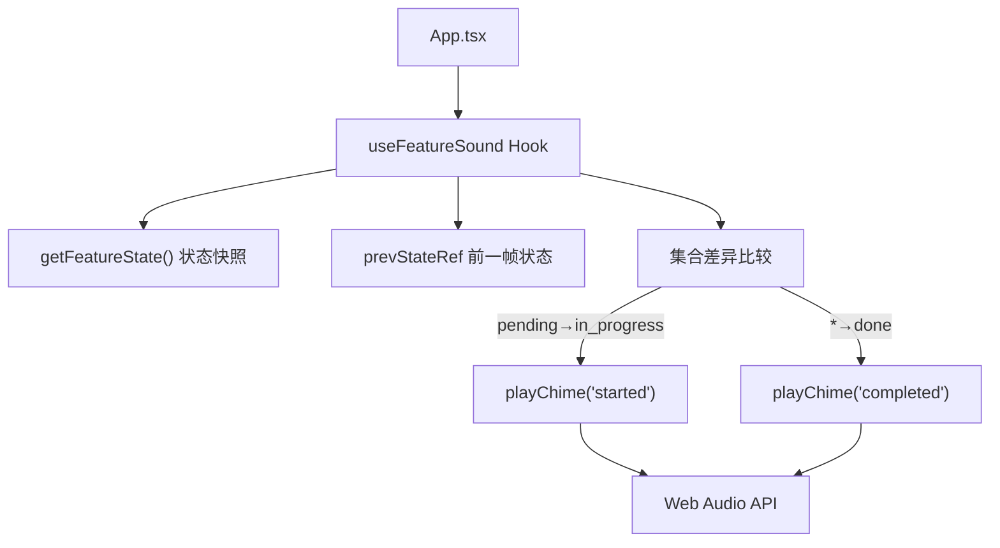

# `useFeatureSound.ts` -- 功能状态变化音效 Hook

> 源文件路径: `ui/src/hooks/useFeatureSound.ts`

## 功能概述

`useFeatureSound.ts` 提供 `useFeatureSound` 自定义 Hook，当功能在看板列之间移动时播放提示音效。使用 Web Audio API 合成不同的音色来区分"开始"和"完成"两种状态变化。

该文件通过比较前后两帧功能状态的 ID 集合来检测功能移动：当功能从 pending 移动到 in_progress 时播放上行双音（"开始"音效），当功能移动到 done 时播放上行三音琶音（"完成"音效）。首次加载时不播放音效以避免打扰用户。

## 依赖关系

### 导入依赖

| 模块 | 说明 |
|------|------|
| `react` | useEffect, useRef |
| `../lib/types` | FeatureListResponse 类型 |

### 被依赖

| 模块 | 引用内容 |
|------|----------|
| `ui/src/App.tsx` | `useFeatureSound` -- 在主组件中监听功能状态变化 |

## 关键类/函数

### `useFeatureSound(features: FeatureListResponse | undefined): void`

- 参数: `features` -- 当前功能列表数据
- 返回值: void
- 说明: 比较当前与上一次的功能状态，检测列间移动并播放对应音效

### `playChime(type: SoundType): void`

- 参数: `type` -- 音效类型（'started' | 'completed'）
- 说明: 使用 Web Audio API 合成并播放音效
- 音效定义:
  - `started`: C5(523Hz) -> E5(659Hz)，每音 0.12 秒
  - `completed`: C5(523Hz) -> E5(659Hz) -> G5(784Hz)，每音 0.15 秒
- 音色: 正弦波（sine），带平滑包络
- 容错: 捕获所有异常，Audio API 不支持时静默失败

### `getFeatureState(features: FeatureListResponse | undefined): FeatureState`

- 参数: `features` -- 功能列表响应
- 返回值: `{ pendingIds: Set<number>, inProgressIds: Set<number>, doneIds: Set<number> }`
- 说明: 将功能列表转换为按状态分组的 ID 集合，用于高效的集合差异比较

### `FeatureState` 接口

```typescript
interface FeatureState {
  pendingIds: Set<number>
  inProgressIds: Set<number>
  doneIds: Set<number>
}
```

### `SOUNDS` 常量

| 键 | 频率 (Hz) | 说明 |
|------|------|------|
| `started` | [523.25, 659.25] | C5 -> E5 上行双音 |
| `completed` | [523.25, 659.25, 783.99] | C5 -> E5 -> G5 上行三音 |

## 架构图



## 注意事项

- 首次加载数据时（`isInitializedRef.current === false`）只记录状态快照不播放音效，避免页面刷新时发出声音。
- 即使多个功能同时移动，每种音效每次更新只播放一次（使用 `break` 中断检测循环）。
- AudioContext 在音效播放完毕后自动关闭（总时长 + 100ms），避免资源泄漏。
- 音效使用 `linearRampToValueAtTime` 和 `exponentialRampToValueAtTime` 创建平滑的包络曲线，避免爆音。
- 该 Hook 使用 Set 数据结构进行 ID 查找，确保 O(1) 的查找复杂度。
- 浏览器的 autoplay 策略可能阻止首次播放，通过 try-catch 静默处理。
