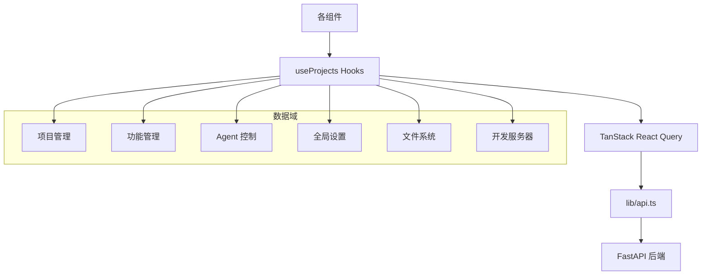

# `useProjects.ts` -- 项目与功能数据管理 Hooks 集合

> 源文件路径: `ui/src/hooks/useProjects.ts`

## 功能概述

`useProjects.ts` 是 AutoForge UI 的核心数据层，提供了一系列基于 TanStack React Query 的自定义 Hooks，封装了所有与后端 REST API 的交互逻辑。

该文件覆盖了以下业务域的数据操作：项目管理（CRUD、重置、设置更新）、功能管理（CRUD、跳过、状态更新、人工输入解决）、Agent 控制（启动/停止/暂停/恢复/优雅暂停）、系统设置（检查状态、健康检查）、文件系统浏览（目录列表、创建、路径验证）、全局设置（模型选择、Provider 管理、乐观更新），以及开发服务器配置。

每个 Mutation Hook 都在成功时自动使相关 Query 缓存失效，确保 UI 数据一致性。

## 依赖关系

### 导入依赖

| 模块 | 说明 |
|------|------|
| `@tanstack/react-query` | useQuery, useMutation, useQueryClient |
| `../lib/api` | 全部 REST API 函数（通过 `* as api` 导入） |
| `../lib/types` | DevServerConfig, FeatureCreate, FeatureUpdate 等多种类型 |

### 被依赖

| 模块 | 引用内容 |
|------|----------|
| `ui/src/App.tsx` | `useProjects`, `useFeatures`, `useAgentStatus`, `useSettings` |
| `ui/src/components/SettingsModal.tsx` | `useSettings`, `useUpdateSettings`, `useAvailableModels`, `useAvailableProviders` |
| `ui/src/components/AddFeatureForm.tsx` | `useCreateFeature` |
| `ui/src/components/SetupWizard.tsx` | `useSetupStatus`, `useHealthCheck` |
| `ui/src/components/DevServerConfigDialog.tsx` | `useDevServerConfig`, `useUpdateDevServerConfig` |
| `ui/src/components/ResetProjectModal.tsx` | `useResetProject` |
| `ui/src/components/NewProjectModal.tsx` | `useCreateProject` |
| `ui/src/components/AgentControl.tsx` | `useStartAgent`, `useStopAgent`, `usePauseAgent`, `useResumeAgent`, `useGracefulPauseAgent`, `useGracefulResumeAgent` |
| `ui/src/components/EditFeatureForm.tsx` | `useUpdateFeature` |
| `ui/src/components/FeatureModal.tsx` | `useSkipFeature`, `useDeleteFeature`, `useFeatures`, `useResolveHumanInput` |
| `ui/src/components/ProjectSelector.tsx` | `useDeleteProject` |

## 关键类/函数

### 项目 Hooks

| Hook | 参数 | 说明 |
|------|------|------|
| `useProjects()` | 无 | 获取所有项目列表 |
| `useProject(name)` | name: string \| null | 获取单个项目详情 |
| `useCreateProject()` | 无 | 创建项目 Mutation |
| `useDeleteProject()` | 无 | 删除项目 Mutation |
| `useResetProject(projectName)` | projectName: string | 重置项目 Mutation（支持完全/快速重置） |
| `useUpdateProjectSettings(projectName)` | projectName: string | 更新项目设置 Mutation |

### 功能 Hooks

| Hook | 参数 | 说明 |
|------|------|------|
| `useFeatures(projectName)` | projectName: string \| null | 获取功能列表，5 秒自动刷新 |
| `useCreateFeature(projectName)` | projectName: string | 创建功能 Mutation |
| `useDeleteFeature(projectName)` | projectName: string | 删除功能 Mutation |
| `useSkipFeature(projectName)` | projectName: string | 跳过功能 Mutation |
| `useUpdateFeature(projectName)` | projectName: string | 更新功能 Mutation |
| `useResolveHumanInput(projectName)` | projectName: string | 解决人工输入请求 Mutation |

### Agent Hooks

| Hook | 参数 | 说明 |
|------|------|------|
| `useAgentStatus(projectName)` | projectName: string \| null | 轮询 Agent 状态，3 秒间隔 |
| `useStartAgent(projectName)` | projectName: string | 启动 Agent Mutation |
| `useStopAgent(projectName)` | projectName: string | 停止 Agent Mutation |
| `usePauseAgent(projectName)` | projectName: string | 暂停 Agent Mutation |
| `useResumeAgent(projectName)` | projectName: string | 恢复 Agent Mutation |
| `useGracefulPauseAgent(projectName)` | projectName: string | 优雅暂停 Mutation |
| `useGracefulResumeAgent(projectName)` | projectName: string | 优雅恢复 Mutation |

### 设置 Hooks

| Hook | 参数 | 说明 |
|------|------|------|
| `useAvailableProviders()` | 无 | 获取可用 Provider 列表，5 分钟缓存 |
| `useAvailableModels()` | 无 | 获取可用模型列表，5 分钟缓存 |
| `useSettings()` | 无 | 获取全局设置，1 分钟缓存 |
| `useUpdateSettings()` | 无 | 更新设置 Mutation（含乐观更新） |

### `useUpdateSettings()` 乐观更新机制

- `onMutate`: 取消进行中的请求，保存旧值快照，立即更新缓存
- `onError`: 回滚到快照值
- `onSettled`: 无论成功失败都重新验证 settings、models、providers 缓存

## 架构图

## 注意事项

- `useFeatures` 配置了 `refetchInterval: 5000`（5 秒），配合 WebSocket 实现双重更新保障。
- `useAgentStatus` 使用 `refetchInterval: 3000`（3 秒）轮询，确保 Agent 状态及时反映。
- `useUpdateSettings` 是唯一实现了乐观更新的 Hook，因为设置修改需要即时反馈用户体验。
- 所有 Hook 都提供了 `DEFAULT_*` 占位数据（`placeholderData`），避免首次加载时显示空白。
- `useStopAgent` 在成功时额外使 `nextRun` 缓存失效，因为手动停止会影响调度状态。
