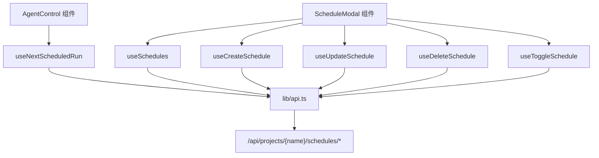

# `useSchedules.ts` -- 调度管理 React Query Hooks

> 源文件路径: `ui/src/hooks/useSchedules.ts`

## 功能概述

`useSchedules.ts` 提供一组基于 TanStack React Query 的自定义 Hooks，封装了 Agent 调度功能的所有 API 交互。调度系统允许用户为项目配置基于时间的自动 Agent 运行计划。

该文件覆盖了调度管理的完整 CRUD 操作：列出项目调度、获取单个调度详情、创建新调度、更新调度、删除调度、切换调度启用状态，以及查询下次计划运行时间。所有 Mutation 操作在成功后会自动使相关缓存失效。

## 依赖关系

### 导入依赖

| 模块 | 说明 |
|------|------|
| `@tanstack/react-query` | useQuery, useMutation, useQueryClient |
| `../lib/api` | 调度相关 API 函数（通过 `* as api` 导入） |
| `../lib/types` | ScheduleCreate, ScheduleUpdate 类型 |

### 被依赖

| 模块 | 引用内容 |
|------|----------|
| `ui/src/components/AgentControl.tsx` | `useNextScheduledRun` -- 显示下次调度运行时间 |
| `ui/src/components/ScheduleModal.tsx` | `useSchedules`, `useCreateSchedule`, `useUpdateSchedule`, `useDeleteSchedule`, `useToggleSchedule` -- 调度管理 UI |

## 关键类/函数

### 查询 Hooks

| Hook | 参数 | 缓存键 | 说明 |
|------|------|--------|------|
| `useSchedules(projectName)` | projectName: string \| null | `['schedules', projectName]` | 获取项目所有调度 |
| `useSchedule(projectName, scheduleId)` | projectName, scheduleId: number \| null | `['schedule', projectName, scheduleId]` | 获取单个调度详情 |
| `useNextScheduledRun(projectName)` | projectName: string \| null | `['nextRun', projectName]` | 获取下次计划运行，30 秒轮询 |

### Mutation Hooks

| Hook | 参数 | 缓存失效 | 说明 |
|------|------|----------|------|
| `useCreateSchedule(projectName)` | projectName: string | schedules + nextRun | 创建新调度 |
| `useUpdateSchedule(projectName)` | projectName: string | schedules + nextRun | 更新调度（接收 {scheduleId, update}） |
| `useDeleteSchedule(projectName)` | projectName: string | schedules + nextRun | 删除调度 |
| `useToggleSchedule(projectName)` | projectName: string | schedules + nextRun | 切换调度启用/禁用状态 |

## 架构图

## 注意事项

- `useNextScheduledRun` 配置了 `refetchInterval: 30000`（30 秒轮询），确保调度状态保持最新。
- 所有 Mutation Hooks 在成功时都会同时使 `schedules` 和 `nextRun` 两个缓存键失效，因为调度修改可能影响下次运行时间。
- `useToggleSchedule` 实际上是 `useUpdateSchedule` 的特化版本，只更新 `enabled` 字段。
- `useSchedule` 需要同时传入 `projectName` 和 `scheduleId`，两者都为非空时才启用查询。
- 调度时间在 UI 端为本地时间格式，在 API 端转换为 UTC 存储。
