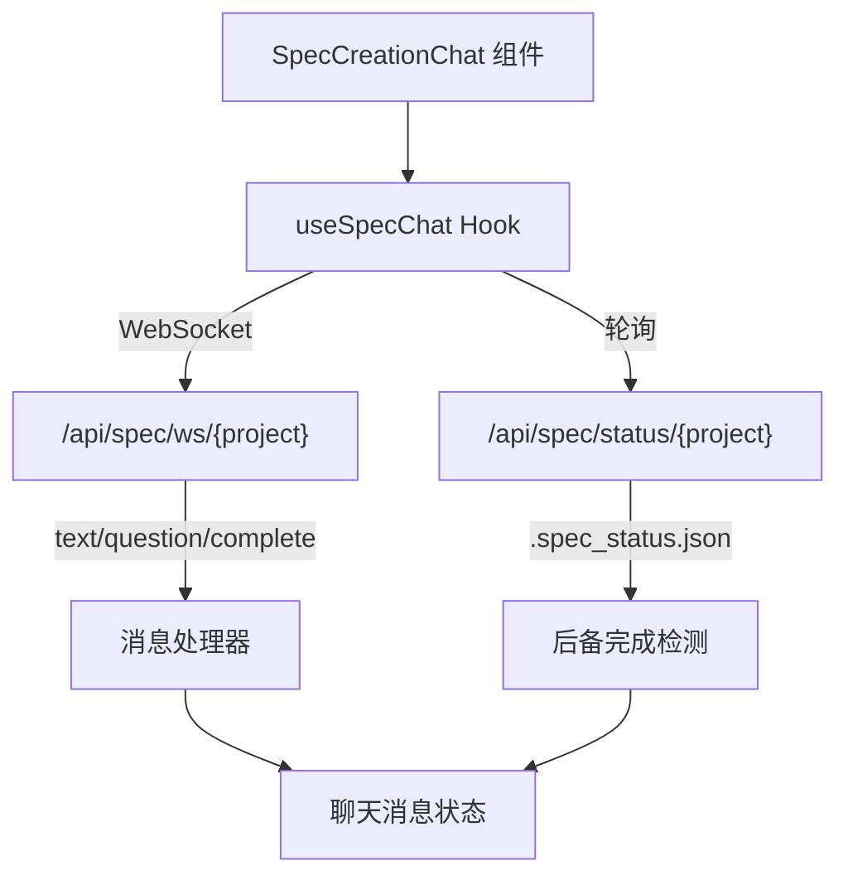

# `useSpecChat.ts` -- Spec 创建聊天 WebSocket Hook

> 源文件路径: `ui/src/hooks/useSpecChat.ts`

## 功能概述

`useSpecChat.ts` 提供 `useSpecChat` 自定义 Hook，管理应用规格（Spec）创建过程中的 WebSocket 聊天连接。它支持与后端 Claude Agent 进行交互式对话，引导用户完成项目规格的创建。

该 Hook 管理完整的聊天生命周期：建立 WebSocket 连接、发送/接收消息、处理流式文本响应、结构化问答交互、图片附件发送、Spec 完成状态检测。它实现了双重完成检测机制 -- 通过 WebSocket 消息和状态文件轮询（每 3 秒），确保即使 WebSocket 消息丢失也能正确检测到 Spec 创建完成。

Hook 内置了连接管理、心跳保活（30 秒）、指数退避重连（最多 3 次）和资源清理等机制。

## 依赖关系

### 导入依赖

| 模块 | 说明 |
|------|------|
| `react` | useState, useCallback, useRef, useEffect |
| `../lib/types` | ChatMessage, ImageAttachment, SpecChatServerMessage, SpecQuestion 类型 |
| `../lib/api` | getSpecStatus -- 状态文件轮询 API |

### 被依赖

| 模块 | 引用内容 |
|------|----------|
| `ui/src/components/SpecCreationChat.tsx` | `useSpecChat` -- Spec 创建聊天界面组件 |

## 关键类/函数

### `useSpecChat(options: UseSpecChatOptions): UseSpecChatReturn`

- 参数:
  - `projectName: string` -- 项目名称
  - `onComplete?: (specPath: string) => void` -- 完成回调（当前未使用，用户通过按钮触发）
  - `onError?: (error: string) => void` -- 错误回调
- 返回值:
  - `messages: ChatMessage[]` -- 聊天消息列表
  - `isLoading: boolean` -- 是否正在等待响应
  - `isComplete: boolean` -- Spec 创建是否完成
  - `connectionStatus: ConnectionStatus` -- 连接状态（disconnected/connecting/connected/error）
  - `currentQuestions: SpecQuestion[] | null` -- 当前待回答的结构化问题
  - `currentToolId: string | null` -- 当前问题对应的工具 ID
  - `start()` -- 启动聊天连接并发送开始消息
  - `sendMessage(content, attachments?)` -- 发送用户消息（支持图片附件）
  - `sendAnswer(answers)` -- 发送结构化问答答案
  - `disconnect()` -- 断开连接

### WebSocket 消息处理

| 消息类型 | 处理逻辑 |
|----------|----------|
| `text` | 追加到当前流式助手消息或创建新消息 |
| `question` | 设置结构化问题列表，停止加载状态 |
| `spec_complete` | 标记完成，添加系统消息（不自动调用 onComplete） |
| `file_written` | 添加文件创建系统消息 |
| `complete` | 标记会话完成 |
| `error` | 显示错误系统消息 |
| `response_done` | 标记当前消息流式结束 |
| `pong` | 心跳响应，不处理 |

### `generateId(): string`

- 返回值: 基于时间戳和随机数的唯一 ID 字符串
- 说明: 用于生成聊天消息 ID

## 架构图

## 注意事项

- Spec 完成后**不会**自动调用 `onComplete` 回调。设计上用户需要手动点击"Continue to Project"按钮来启动 Agent，这与 CLI 行为保持一致。
- 状态文件轮询作为 WebSocket 的后备检测机制，在初始 3 秒延迟后启动，每 3 秒检查一次 `.spec_status.json`。
- 图片附件在发送时只传输 `base64Data`，不传输 `previewUrl`，以减少传输数据量。
- `isCompleteRef` 使用 useRef 而非直接在回调中读取 `isComplete` 状态，以避免闭包中的过期值问题。
- 指数退避重连在 Spec 已完成或遇到应用级错误（4xxx）时不会触发。
