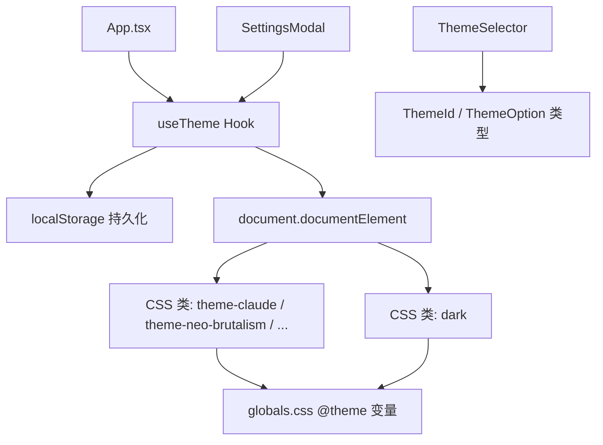

# `useTheme.ts` -- 主题与暗色模式管理 Hook

> 源文件路径: `ui/src/hooks/useTheme.ts`

## 功能概述

`useTheme.ts` 提供 `useTheme` 自定义 Hook 和主题配置常量，管理 AutoForge UI 的视觉主题系统和暗色模式切换。

该文件定义了 6 种可选主题（Twitter、Claude、Neo Brutalism、Retro Arcade、Aurora、Business），每种主题通过 CSS 类名切换实现不同的色彩方案。主题和暗色模式设置持久化到 localStorage，并通过操作 `document.documentElement` 的 CSS 类名来应用样式变化。

Hook 导出主题类型定义（`ThemeId`、`ThemeOption`）、主题常量（`THEMES`），以及完整的主题操作 API。

## 依赖关系

### 导入依赖

| 模块 | 说明 |
|------|------|
| `react` | useState, useEffect, useCallback |

### 被依赖

| 模块 | 引用内容 |
|------|----------|
| `ui/src/App.tsx` | `useTheme` -- 获取主题状态和切换方法 |
| `ui/src/components/SettingsModal.tsx` | `useTheme`, `THEMES` -- 设置面板中的主题选择 |
| `ui/src/components/ThemeSelector.tsx` | `ThemeId`, `ThemeOption` 类型 -- 主题选择器组件 |

## 关键类/函数

### 类型定义

#### `ThemeId`

```typescript
type ThemeId = 'twitter' | 'claude' | 'neo-brutalism' | 'retro-arcade' | 'aurora' | 'business'
```

#### `ThemeOption`

```typescript
interface ThemeOption {
  id: ThemeId
  name: string
  description: string
  previewColors: { primary: string; background: string; accent: string }
}
```

### `THEMES: ThemeOption[]`

| 主题 ID | 名称 | 描述 | 主色 |
|---------|------|------|------|
| `twitter` | Twitter | 清爽现代蓝色设计 | #4a9eff |
| `claude` | Claude | 暖米色调配橙色强调 | #c75b2a |
| `neo-brutalism` | Neo Brutalism | 大胆色彩与硬阴影 | #ff4d00 |
| `retro-arcade` | Retro Arcade | 粉色与青色像素风 | #e8457c |
| `aurora` | Aurora | 深紫与青色极光风 | #8b5cf6 |
| `business` | Business | 深海军蓝灰色单色调 | #000e4e |

### `useTheme()`

- 返回值:
  - `theme: ThemeId` -- 当前主题 ID
  - `setTheme(newTheme: ThemeId)` -- 设置主题
  - `darkMode: boolean` -- 暗色模式状态
  - `setDarkMode(enabled: boolean)` -- 设置暗色模式
  - `toggleDarkMode()` -- 切换暗色模式
  - `themes: ThemeOption[]` -- 所有可用主题列表
  - `currentTheme: ThemeOption` -- 当前主题详情对象

### `getThemeClass(themeId: ThemeId): string`

- 参数: 主题 ID
- 返回值: 对应的 CSS 类名（twitter 返回空字符串，其他返回 `theme-{id}`）
- 说明: 内部函数，将主题 ID 映射为 DOM 根元素的 CSS 类名

## 架构图



## 注意事项

- Twitter 主题是默认主题，不需要额外的 CSS 类（使用 `globals.css` 中的默认变量值）。
- 主题切换时会先移除所有主题类再添加新的，确保不会有类名残留。
- localStorage 键名为 `autoforge-theme`（主题）和 `autoforge-dark-mode`（暗色模式），所有读写都包裹在 try-catch 中以处理 localStorage 不可用的情况。
- `currentTheme` 使用 `THEMES.find()` 查找，找不到时回退到 `THEMES[0]`（Twitter）。
- 暗色模式通过添加/移除 `dark` CSS 类实现，与 Tailwind CSS v4 的暗色模式系统配合使用。
