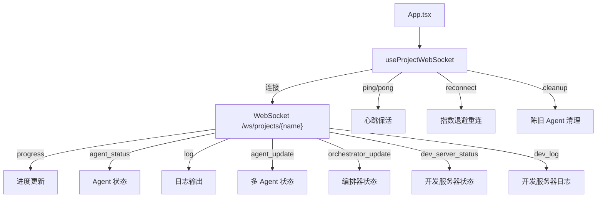

# `useWebSocket.ts` -- 项目 WebSocket 实时通信 Hook

> 源文件路径: `ui/src/hooks/useWebSocket.ts`

## 功能概述

`useWebSocket.ts` 提供 `useProjectWebSocket` 自定义 Hook，管理与后端服务器的 WebSocket 连接，实现项目数据的实时推送与接收。它是 AutoForge UI 实时更新能力的核心基础设施。

该 Hook 处理以下 WebSocket 消息类型：进度更新（`progress`）、Agent 状态变化（`agent_status`）、日志输出（`log`）、功能更新（`feature_update`）、多 Agent 更新（`agent_update`）、编排器更新（`orchestrator_update`）、开发服务器日志（`dev_log`）和开发服务器状态（`dev_server_status`）。

Hook 内置了完善的连接管理机制，包括指数退避重连（最大 30 秒间隔）、心跳 ping（每 30 秒）、应用级错误不重试（4xxx 错误码）、陈旧 Agent 自动清理（30 分钟超时），以及庆祝动画队列管理。

## 依赖关系

### 导入依赖

| 模块 | 说明 |
|------|------|
| `react` | useEffect, useRef, useState, useCallback |
| `../lib/types` | WSMessage, AgentStatus, DevServerStatus, ActiveAgent, AgentMascot, AgentLogEntry, OrchestratorStatus, OrchestratorEvent 类型 |

### 被依赖

| 模块 | 引用内容 |
|------|----------|
| `ui/src/App.tsx` | `useProjectWebSocket` -- 主组件中获取所有实时状态 |

## 关键类/函数

### `useProjectWebSocket(projectName: string | null)`

- 参数: `projectName` -- 当前选中的项目名，null 时断开连接
- 返回值: `WebSocketState` 及操作方法:
  - `progress`: 进度数据（passing, in_progress, needs_human_input, total, percentage）
  - `agentStatus`: Agent 运行状态（AgentStatus 类型）
  - `logs`: 全局日志数组（最多 100 条）
  - `isConnected`: WebSocket 连接状态
  - `devServerStatus` / `devServerUrl`: 开发服务器状态
  - `devLogs`: 开发服务器日志
  - `activeAgents`: 当前活跃的 Agent 列表（ActiveAgent[]）
  - `recentActivity`: 最近活动流（最多 20 条）
  - `agentLogs`: 按 Agent 索引的独立日志 Map（每个最多 500 条）
  - `celebration` / `celebrationQueue`: 庆祝动画状态与队列
  - `orchestratorStatus`: 编排器状态
  - `clearLogs()`: 清空全局日志
  - `clearDevLogs()`: 清空开发服务器日志
  - `clearCelebration()`: 清除当前庆祝并弹出队列中的下一个
  - `getAgentLogs(agentIndex)`: 获取指定 Agent 的日志
  - `clearAgentLogs(agentIndex)`: 清除指定 Agent 的日志

### 常量

| 常量 | 值 | 说明 |
|------|------|------|
| `MAX_LOGS` | 100 | 全局日志最大保留条数 |
| `MAX_ACTIVITY` | 20 | 活动流最大保留条数 |
| `MAX_AGENT_LOGS` | 500 | 每个 Agent 日志最大保留条数 |

### 内部接口

- `ActivityItem`: 活动流项目（agentName, thought, timestamp, featureId）
- `CelebrationTrigger`: 庆祝触发器（agentName, featureName, featureId）
- `WebSocketState`: 完整的 WebSocket 状态接口

## 架构图

## 注意事项

- WebSocket URL 自动根据当前页面协议选择 `ws:` 或 `wss:`，支持 HTTPS 环境。
- 当项目切换时，所有状态完全重置，`agentStatus` 初始化为 `'loading'` 以显示加载指示器。
- 应用级错误（HTTP 4xxx 状态码关闭）不会触发重连，因为这类错误重试无意义。
- 庆祝动画使用队列机制处理快速连续的成功事件，确保每个成功都能被展示。
- 陈旧 Agent 清理每分钟执行一次，阈值为 30 分钟，用于处理 UI 长时间开启但错过完成消息的边缘情况。
- Agent 在 `success` 或 `error` 状态时会从 `activeAgents` 列表中移除，但日志保留在 `agentLogs` Map 中用于事后调试。
