# 工具库与类型定义

> `ui/src/lib/` 目录包含 TypeScript 类型定义、REST API 客户端、样式工具函数、键盘事件工具和时间转换工具，是整个前端的基础设施层。

## 目录结构

```
lib/
├── types.ts      # TypeScript 类型系统 (655 行)
├── api.ts        # REST API 客户端 (566 行)
├── timeUtils.ts  # 时区转换与日期工具 (252 行)
├── keyboard.ts   # 键盘事件工具 (38 行)
└── utils.ts      # 样式合并工具 (6 行)
```

## 文件清单

| 文件 | 行数 | 说明 |
|------|------|------|
| `types.ts` | 655 | 完整 TypeScript 类型系统，覆盖项目、特性、Agent、WebSocket、聊天、设置、调度等全部领域 |
| `api.ts` | 566 | REST API 客户端，所有后端端点的类型安全封装 |
| `timeUtils.ts` | 252 | UTC/本地时间转换、星期位域操作、时长格式化等工具函数 |
| `keyboard.ts` | 38 | IME 感知的 Enter 键提交判断 |
| `utils.ts` | 6 | `cn()` -- clsx + tailwind-merge 的样式合并函数 |

## types.ts 详解

完整的 TypeScript 类型系统，按领域组织为多个模块：

### 项目类型

| 类型 | 说明 |
|------|------|
| `ProjectStats` | 项目统计（passing/in_progress/total/percentage） |
| `ProjectSummary` | 项目摘要（name/path/has_spec/stats/default_concurrency） |
| `ProjectDetail` | 项目详情（继承 Summary，增加 prompts_dir） |
| `ProjectPrompts` | 项目提示词（app_spec/initializer_prompt/coding_prompt） |
| `ProjectSettingsUpdate` | 项目设置更新（default_concurrency） |

### 文件系统类型

| 类型 | 说明 |
|------|------|
| `DriveInfo` | 驱动器信息（letter/label/available） |
| `DirectoryEntry` | 目录条目（name/path/is_directory/has_children） |
| `DirectoryListResponse` | 目录列表响应（current_path/parent_path/entries/drives） |
| `PathValidationResponse` | 路径验证结果（valid/exists/is_directory/can_write/message） |

### 人工输入类型

| 类型 | 说明 |
|------|------|
| `HumanInputField` | 输入字段定义（id/label/type/required/placeholder/options） |
| `HumanInputRequest` | 输入请求（prompt/fields） |
| `HumanInputResponseData` | 输入响应数据（fields/responded_at） |

### 特性类型

| 类型 | 说明 |
|------|------|
| `Feature` | 完整特性模型（id/priority/category/name/description/steps/passes/in_progress/dependencies/blocked/needs_human_input...） |
| `FeatureStatus` | 状态枚举 -- `'pending' \| 'in_progress' \| 'done' \| 'blocked' \| 'needs_human_input'` |
| `FeatureListResponse` | 按状态分组的特性列表（pending/in_progress/done/needs_human_input） |
| `FeatureCreate` | 创建特性请求 |
| `FeatureUpdate` | 更新特性请求 |
| `FeatureBulkCreate` | 批量创建请求 |
| `FeatureBulkCreateResponse` | 批量创建响应 |

### 图可视化类型

| 类型 | 说明 |
|------|------|
| `GraphNode` | 图节点（id/name/category/status/priority/dependencies） |
| `GraphEdge` | 图边（source/target） |
| `DependencyGraph` | 完整依赖图（nodes/edges） |

### Agent 类型

| 类型 | 说明 |
|------|------|
| `AgentStatus` | 状态枚举 -- `'stopped' \| 'running' \| 'paused' \| 'crashed' \| 'loading' \| 'pausing' \| 'paused_graceful'` |
| `AgentState` | Agent 工作状态 -- `'idle' \| 'thinking' \| 'working' \| 'testing' \| 'success' \| 'error' \| 'struggling'` |
| `AgentType` | Agent 类型 -- `'coding' \| 'testing'` |
| `AgentMascot` | 吉祥物名称联合类型（20 个名称） |
| `AGENT_MASCOTS` | 吉祥物常量数组（Spark/Fizz/Octo/Hoot/Buzz + 15 个扩展） |
| `ActiveAgent` | 活跃 Agent 完整信息（agentIndex/agentName/agentType/featureId/featureIds/state/thought/timestamp/logs） |
| `AgentLogEntry` | Agent 日志条目（line/timestamp/type） |
| `AgentStatusResponse` | Agent 状态 API 响应 |
| `AgentActionResponse` | Agent 操作 API 响应 |

### 编排器类型

| 类型 | 说明 |
|------|------|
| `OrchestratorState` | 编排器状态 -- `'idle' \| 'initializing' \| 'scheduling' \| 'spawning' \| 'monitoring' \| 'complete' \| 'draining' \| 'paused'` |
| `OrchestratorEvent` | 编排器事件（eventType/message/timestamp/featureId/featureName） |
| `OrchestratorStatus` | 编排器完整状态 |

### WebSocket 消息类型

| 消息类型 | 接口 | 说明 |
|----------|------|------|
| `progress` | `WSProgressMessage` | 进度更新 |
| `feature_update` | `WSFeatureUpdateMessage` | 特性更新 |
| `log` | `WSLogMessage` | 日志消息 |
| `agent_status` | `WSAgentStatusMessage` | Agent 状态 |
| `agent_update` | `WSAgentUpdateMessage` | Agent 详细更新 |
| `orchestrator_update` | `WSOrchestratorUpdateMessage` | 编排器更新 |
| `dev_log` | `WSDevLogMessage` | 开发服务器日志 |
| `dev_server_status` | `WSDevServerStatusMessage` | 开发服务器状态 |
| `pong` | `WSPongMessage` | 心跳响应 |

联合类型 `WSMessage` 汇总所有消息类型，用于 `useWebSocket` 的类型安全解析。

### Spec 聊天类型

| 类型 | 说明 |
|------|------|
| `SpecQuestion` | 问题（question/header/options/multiSelect） |
| `SpecQuestionOption` | 问题选项（label/description） |
| `SpecChatServerMessage` | 服务端消息联合（text/question/spec_complete/file_written/complete/error/pong/response_done） |
| `ImageAttachment` | 图片附件（id/filename/mimeType/base64Data/previewUrl/size） |
| `ChatMessage` | UI 聊天消息（id/role/content/attachments/timestamp/questions/isStreaming） |

### 助手聊天类型

| 类型 | 说明 |
|------|------|
| `AssistantConversation` | 对话摘要 |
| `AssistantConversationDetail` | 对话详情（含消息列表） |
| `AssistantChatServerMessage` | 服务端消息联合（text/tool_call/question/response_done/error/conversation_created/pong） |

### 扩展聊天类型

| 类型 | 说明 |
|------|------|
| `ExpandChatFeaturesCreatedMessage` | 特性创建通知 |
| `ExpandChatCompleteMessage` | 扩展完成 |
| `ExpandChatServerMessage` | 服务端消息联合（复用 Spec 的 text/error/pong/response_done） |

### 设置类型

| 类型 | 说明 |
|------|------|
| `Settings` | 全局设置（yolo_mode/model/glm_mode/ollama_mode/testing_agent_ratio/playwright_headless/batch_size/testing_batch_size/api_provider/api_base_url/api_has_auth_token/api_model） |
| `SettingsUpdate` | 设置更新请求 |
| `ModelInfo` | 模型信息（id/name） |
| `ModelsResponse` | 模型列表响应 |
| `ProviderInfo` | API 提供商信息 |
| `ProvidersResponse` | 提供商列表响应 |

### 调度类型

| 类型 | 说明 |
|------|------|
| `Schedule` | 调度完整模型（id/project_name/start_time/duration_minutes/days_of_week/enabled/yolo_mode/model/max_concurrency/crash_count） |
| `ScheduleCreate` | 创建请求 |
| `ScheduleUpdate` | 更新请求 |
| `NextRunResponse` | 下次运行信息 |

## api.ts 详解

所有 REST API 端点的类型安全封装，按领域组织。

### 基础设施

```typescript
const API_BASE = '/api'
async function fetchJSON<T>(url: string, options?: RequestInit): Promise<T>
```

`fetchJSON` 统一处理 JSON 请求/响应、错误解析和 204 No Content。

### API 分组

| 域 | 函数 | 方法 | 路径 |
|----|------|------|------|
| **项目** | `listProjects` | GET | `/projects` |
| | `createProject` | POST | `/projects` |
| | `getProject` | GET | `/projects/{name}` |
| | `deleteProject` | DELETE | `/projects/{name}` |
| | `getProjectPrompts` | GET | `/projects/{name}/prompts` |
| | `updateProjectPrompts` | PUT | `/projects/{name}/prompts` |
| | `updateProjectSettings` | PATCH | `/projects/{name}/settings` |
| | `resetProject` | POST | `/projects/{name}/reset` |
| **特性** | `listFeatures` | GET | `/projects/{name}/features` |
| | `createFeature` | POST | `/projects/{name}/features` |
| | `getFeature` | GET | `/projects/{name}/features/{id}` |
| | `deleteFeature` | DELETE | `/projects/{name}/features/{id}` |
| | `skipFeature` | PATCH | `/projects/{name}/features/{id}/skip` |
| | `updateFeature` | PATCH | `/projects/{name}/features/{id}` |
| | `createFeaturesBulk` | POST | `/projects/{name}/features/bulk` |
| | `resolveHumanInput` | POST | `/projects/{name}/features/{id}/resolve-human-input` |
| **依赖图** | `getDependencyGraph` | GET | `/projects/{name}/features/graph` |
| | `addDependency` | POST | `/projects/{name}/features/{id}/dependencies/{depId}` |
| | `removeDependency` | DELETE | `/projects/{name}/features/{id}/dependencies/{depId}` |
| | `setDependencies` | PUT | `/projects/{name}/features/{id}/dependencies` |
| **Agent** | `getAgentStatus` | GET | `/projects/{name}/agent/status` |
| | `startAgent` | POST | `/projects/{name}/agent/start` |
| | `stopAgent` | POST | `/projects/{name}/agent/stop` |
| | `pauseAgent` | POST | `/projects/{name}/agent/pause` |
| | `resumeAgent` | POST | `/projects/{name}/agent/resume` |
| | `gracefulPauseAgent` | POST | `/projects/{name}/agent/graceful-pause` |
| | `gracefulResumeAgent` | POST | `/projects/{name}/agent/graceful-resume` |
| **Spec** | `getSpecStatus` | GET | `/spec/status/{name}` |
| **设置** | `getSettings` | GET | `/settings` |
| | `updateSettings` | PATCH | `/settings` |
| | `getAvailableModels` | GET | `/settings/models` |
| | `getAvailableProviders` | GET | `/settings/providers` |
| **设置/检查** | `getSetupStatus` | GET | `/setup/status` |
| | `healthCheck` | GET | `/health` |
| **文件系统** | `listDirectory` | GET | `/filesystem/list` |
| | `createDirectory` | POST | `/filesystem/create-directory` |
| | `validatePath` | POST | `/filesystem/validate` |
| **助手** | `listAssistantConversations` | GET | `/assistant/conversations/{name}` |
| | `getAssistantConversation` | GET | `/assistant/conversations/{name}/{id}` |
| | `createAssistantConversation` | POST | `/assistant/conversations/{name}` |
| | `deleteAssistantConversation` | DELETE | `/assistant/conversations/{name}/{id}` |
| **开发服务器** | `getDevServerStatus` | GET | `/projects/{name}/devserver/status` |
| | `startDevServer` | POST | `/projects/{name}/devserver/start` |
| | `stopDevServer` | POST | `/projects/{name}/devserver/stop` |
| | `getDevServerConfig` | GET | `/projects/{name}/devserver/config` |
| | `updateDevServerConfig` | PATCH | `/projects/{name}/devserver/config` |
| **终端** | `listTerminals` | GET | `/terminal/{name}` |
| | `createTerminal` | POST | `/terminal/{name}` |
| | `renameTerminal` | PATCH | `/terminal/{name}/{id}` |
| | `deleteTerminal` | DELETE | `/terminal/{name}/{id}` |
| **调度** | `listSchedules` | GET | `/projects/{name}/schedules` |
| | `createSchedule` | POST | `/projects/{name}/schedules` |
| | `getSchedule` | GET | `/projects/{name}/schedules/{id}` |
| | `updateSchedule` | PATCH | `/projects/{name}/schedules/{id}` |
| | `deleteSchedule` | DELETE | `/projects/{name}/schedules/{id}` |
| | `getNextScheduledRun` | GET | `/projects/{name}/schedules/next` |

## timeUtils.ts 详解

时区转换和调度相关的工具函数集。

### 时间转换

| 函数 | 说明 |
|------|------|
| `utcToLocal(utcTime)` | UTC "HH:MM" 转本地时间 |
| `utcToLocalWithDayShift(utcTime)` | UTC 转本地，返回日期偏移信息 |
| `localToUTC(localTime)` | 本地 "HH:MM" 转 UTC |
| `localToUTCWithDayShift(localTime)` | 本地转 UTC，返回日期偏移信息 |

### 星期位域操作

`days_of_week` 使用 7 位二进制位域：Mon=1, Tue=2, Wed=4, Thu=8, Fri=16, Sat=32, Sun=64。

| 函数 | 说明 |
|------|------|
| `shiftDaysForward(bitfield)` | 位域前移一天（Mon→Tue, Sun→Mon） |
| `shiftDaysBackward(bitfield)` | 位域后移一天（Tue→Mon, Mon→Sun） |
| `adjustDaysForDayShift(bitfield, dayShift)` | 根据日期偏移调整位域 |
| `isDayActive(bitfield, dayBit)` | 检查某天是否激活 |
| `toggleDay(bitfield, dayBit)` | 切换某天激活状态 |
| `formatDaysDescription(bitfield)` | 格式化星期描述（"Every day"/"Weekdays"/"Mon, Wed, Fri"） |

### 格式化

| 函数 | 说明 |
|------|------|
| `formatDuration(minutes)` | 格式化时长（"4h"/"1h 30m"/"30m"） |
| `formatNextRun(isoString)` | 格式化下次运行时间 |
| `formatEndTime(isoString)` | 格式化结束时间 |

## keyboard.ts 详解

```typescript
isSubmitEnter(e: React.KeyboardEvent, allowShiftEnter?: boolean): boolean
```

IME 感知的 Enter 键提交判断：
- 非 Enter 键返回 `false`
- Shift+Enter 时返回 `false`（多行输入场景）
- IME 组合输入中返回 `false`（防止中日韩输入法误触发）
- 其他情况返回 `true`

## utils.ts 详解

```typescript
export function cn(...inputs: ClassValue[]) {
  return twMerge(clsx(inputs))
}
```

组合 `clsx`（条件类名合并）和 `tailwind-merge`（Tailwind 类名冲突解决），是所有组件的样式工具基础。

## 类型层级图

```mermaid
graph TB
    subgraph "项目域"
        PS["ProjectStats"]
        PSm["ProjectSummary"]
        PD["ProjectDetail"]
        PP["ProjectPrompts"]
        PSU["ProjectSettingsUpdate"]
        PSm --> PS
        PD --> PSm
    end

    subgraph "特性域"
        F["Feature"]
        FS["FeatureStatus"]
        FLR["FeatureListResponse"]
        FC["FeatureCreate"]
        FU["FeatureUpdate"]
        FBC["FeatureBulkCreate"]
        FLR --> F
        FBC --> FC
    end

    subgraph "图域"
        GN["GraphNode"]
        GE["GraphEdge"]
        DG["DependencyGraph"]
        DG --> GN
        DG --> GE
        GN --> FS
    end

    subgraph "Agent 域"
        AS["AgentStatus"]
        ASt["AgentState"]
        AT["AgentType"]
        AM["AgentMascot"]
        AA["ActiveAgent"]
        ALE["AgentLogEntry"]
        AA --> ASt
        AA --> AM
        AA --> AT
        AA --> ALE
    end

    subgraph "编排器域"
        OS["OrchestratorState"]
        OE["OrchestratorEvent"]
        OSt["OrchestratorStatus"]
        OSt --> OS
        OSt --> OE
    end

    subgraph "WebSocket 域"
        WSM["WSMessage (联合)"]
        WSP["WSProgressMessage"]
        WSL["WSLogMessage"]
        WSAS["WSAgentStatusMessage"]
        WSAU["WSAgentUpdateMessage"]
        WSOU["WSOrchestratorUpdateMessage"]
        WSM --> WSP
        WSM --> WSL
        WSM --> WSAS
        WSM --> WSAU
        WSM --> WSOU
        WSAU --> ASt
        WSAU --> AM
    end

    subgraph "聊天域"
        CM["ChatMessage"]
        IA["ImageAttachment"]
        SQ["SpecQuestion"]
        SCSM["SpecChatServerMessage"]
        ACSM["AssistantChatServerMessage"]
        ECSM["ExpandChatServerMessage"]
        CM --> IA
        CM --> SQ
    end

    subgraph "设置域"
        S["Settings"]
        SU["SettingsUpdate"]
        MI["ModelInfo"]
        PI["ProviderInfo"]
        PI --> MI
    end

    subgraph "调度域"
        Sch["Schedule"]
        SchC["ScheduleCreate"]
        SchU["ScheduleUpdate"]
        NRR["NextRunResponse"]
    end
```



## 依赖关系

```
lib/
├── types.ts         → 无外部依赖（纯类型定义）
├── api.ts           → types.ts（导入所有接口类型）
├── timeUtils.ts     → 无外部依赖（纯工具函数）
├── keyboard.ts      → React（React.KeyboardEvent 类型）
└── utils.ts         → clsx, tailwind-merge
```

## 关键模式

1. **类型驱动开发**: `types.ts` 作为前后端契约的单一真相来源，所有 API 调用和 WebSocket 消息都有完整类型定义
2. **领域分组**: 类型按业务领域组织，使用 `// ============` 注释分隔，便于导航
3. **联合类型鉴别**: WebSocket 消息使用 `type` 字段作为鉴别器，实现类型安全的 `switch/case` 处理
4. **渐进增强**: `Feature.dependencies` 等字段标记为可选（`?`），确保与旧版本后端的向后兼容
5. **路径编码**: API 客户端统一使用 `encodeURIComponent` 编码项目名，安全处理特殊字符
6. **IME 兼容**: `keyboard.ts` 通过检查 `nativeEvent.isComposing` 确保中日韩输入法用户体验
