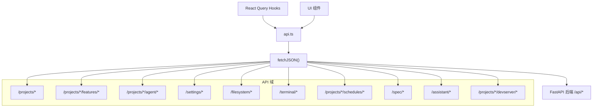

# `api.ts` -- REST API 客户端

> 源文件路径: `ui/src/lib/api.ts`

## 功能概述

`api.ts` 是 AutoForge React UI 的 REST API 客户端层，封装了与 FastAPI 后端的所有 HTTP 通信。它提供了类型安全的异步函数集合，覆盖了应用的全部 REST API 端点。

该文件以统一的 `fetchJSON<T>()` 函数为基础，处理请求头设置（Content-Type: application/json）、错误响应解析、HTTP 204 空响应处理等通用逻辑。所有 API 函数都通过 `API_BASE = '/api'` 前缀与后端通信。

文件按业务域分为以下区段：项目管理（Projects）、功能管理（Features）、依赖图（Dependency Graph）、Agent 控制、Spec 创建、系统设置（Setup）、文件系统浏览、助手聊天（Assistant Chat）、全局设置（Settings）、开发服务器（Dev Server）、终端（Terminal）、调度（Schedule）。

## 依赖关系

### 导入依赖

| 模块 | 说明 |
|------|------|
| `./types` | 全部 TypeScript 接口类型（30+ 种类型导入） |

### 被依赖

| 模块 | 引用内容 |
|------|----------|
| `ui/src/App.tsx` | `getDependencyGraph`, `startAgent` |
| `ui/src/hooks/useProjects.ts` | `* as api` -- 全部项目/功能/Agent/设置 API |
| `ui/src/hooks/useConversations.ts` | `* as api` -- 对话管理 API |
| `ui/src/hooks/useSchedules.ts` | `* as api` -- 调度管理 API |
| `ui/src/hooks/useSpecChat.ts` | `getSpecStatus` -- Spec 状态轮询 |
| `ui/src/components/DebugLogViewer.tsx` | `listTerminals`, `createTerminal`, `renameTerminal`, `deleteTerminal` |
| `ui/src/components/FolderBrowser.tsx` | `* as api` -- 文件系统浏览 |
| `ui/src/components/NewProjectModal.tsx` | `startAgent` |
| `ui/src/components/DevServerConfigDialog.tsx` | `startDevServer` |
| `ui/src/components/DevServerControl.tsx` | `startDevServer`, `stopDevServer` |

## 关键类/函数

### `fetchJSON<T>(url: string, options?: RequestInit): Promise<T>`

- 说明: 核心请求函数，添加 `API_BASE` 前缀和 JSON 请求头
- 错误处理: 非 2xx 响应时解析 `detail` 字段抛出 Error
- 特殊处理: HTTP 204 返回 `undefined as T`

### 项目 API

| 函数 | 方法 | 端点 | 说明 |
|------|------|------|------|
| `listProjects()` | GET | `/projects` | 获取项目列表 |
| `createProject(name, path, specMethod)` | POST | `/projects` | 创建项目 |
| `getProject(name)` | GET | `/projects/{name}` | 获取项目详情 |
| `deleteProject(name)` | DELETE | `/projects/{name}` | 删除项目 |
| `updateProjectSettings(name, settings)` | PATCH | `/projects/{name}/settings` | 更新项目设置 |
| `resetProject(name, fullReset)` | POST | `/projects/{name}/reset` | 重置项目 |

### 功能 API

| 函数 | 方法 | 端点 | 说明 |
|------|------|------|------|
| `listFeatures(projectName)` | GET | `/projects/{name}/features` | 获取功能列表 |
| `createFeature(projectName, feature)` | POST | `/projects/{name}/features` | 创建功能 |
| `deleteFeature(projectName, featureId)` | DELETE | `/projects/{name}/features/{id}` | 删除功能 |
| `updateFeature(projectName, featureId, update)` | PATCH | `/projects/{name}/features/{id}` | 更新功能 |
| `skipFeature(projectName, featureId)` | PATCH | `/projects/{name}/features/{id}/skip` | 跳过功能 |
| `resolveHumanInput(projectName, featureId, response)` | POST | `/projects/{name}/features/{id}/resolve-human-input` | 解决人工输入 |
| `createFeaturesBulk(projectName, bulk)` | POST | `/projects/{name}/features/bulk` | 批量创建 |

### 依赖图 API

| 函数 | 方法 | 端点 | 说明 |
|------|------|------|------|
| `getDependencyGraph(projectName)` | GET | `/projects/{name}/features/graph` | 获取依赖图数据 |
| `addDependency(projectName, featureId, depId)` | POST | `/projects/{name}/features/{id}/dependencies/{depId}` | 添加依赖 |
| `removeDependency(projectName, featureId, depId)` | DELETE | `/projects/{name}/features/{id}/dependencies/{depId}` | 移除依赖 |
| `setDependencies(projectName, featureId, depIds)` | PUT | `/projects/{name}/features/{id}/dependencies` | 设置全部依赖 |

### Agent API

| 函数 | 方法 | 端点 |
|------|------|------|
| `getAgentStatus(projectName)` | GET | `/projects/{name}/agent/status` |
| `startAgent(projectName, options)` | POST | `/projects/{name}/agent/start` |
| `stopAgent(projectName)` | POST | `/projects/{name}/agent/stop` |
| `pauseAgent(projectName)` | POST | `/projects/{name}/agent/pause` |
| `resumeAgent(projectName)` | POST | `/projects/{name}/agent/resume` |
| `gracefulPauseAgent(projectName)` | POST | `/projects/{name}/agent/graceful-pause` |
| `gracefulResumeAgent(projectName)` | POST | `/projects/{name}/agent/graceful-resume` |

### `createDirectory(fullPath: string)`

- 说明: 将完整路径拆分为 `parent_path` 和 `name`（后端 API 要求的格式）
- 支持: Unix 路径、Windows 驱动器根路径（如 `C:/newfolder`）
- 验证: 必须是绝对路径，目录名不能为空

## 架构图

## 注意事项

- 所有项目名和路径参数都通过 `encodeURIComponent()` 编码，确保特殊字符安全传输。
- `fetchJSON` 在错误时会尝试解析 JSON 响应体中的 `detail` 字段，解析失败时回退到 'Unknown error'。
- `createDirectory` 包含跨平台路径解析逻辑，正确处理 Unix 根路径（`/newfolder`）和 Windows 驱动器路径（`C:/newfolder`）。
- `startAgent` 的选项参数使用蛇形命名法（`yolo_mode`、`parallel_mode`）匹配后端 API 的 Python 命名约定。
- API 基础路径 `/api` 在 Vite 开发服务器中通过代理转发到 FastAPI 后端。
- 该文件还导出了 `SpecFileStatus` 和 `ResetProjectResponse` 接口，用于特定 API 的响应类型。
