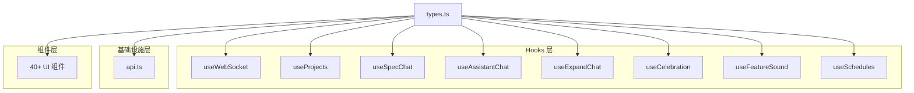

# `types.ts` -- 全局 TypeScript 类型定义

> 源文件路径: `ui/src/lib/types.ts`

## 功能概述

`types.ts` 是 AutoForge React UI 的全局类型定义文件，包含了所有前端数据模型的 TypeScript 接口和类型别名。它是整个 UI 层的类型基础，被几乎所有组件和 Hook 依赖。

该文件按业务域组织类型定义，覆盖了以下领域：项目（ProjectSummary/ProjectDetail）、文件系统（DirectoryEntry/PathValidation）、人工输入（HumanInputField/Request/Response）、功能（Feature/FeatureCreate/FeatureUpdate）、依赖图（GraphNode/GraphEdge）、Agent 状态（AgentStatus/ActiveAgent/OrchestratorStatus）、WebSocket 消息（WSMessage 联合类型，9 种消息类型）、Spec 聊天、助手聊天、扩展聊天、批量功能创建、全局设置（Settings/Provider/Model）、调度（Schedule/ScheduleCreate）。

文件还导出了 `AGENT_MASCOTS` 常量数组（20 个 Agent 吉祥物名称），用于多 Agent 并行模式的 UI 展示。

## 依赖关系

### 导入依赖

| 模块 | 说明 |
|------|------|
| 无 | 纯类型定义文件，不依赖其他模块 |

### 被依赖

该文件被以下 40+ 个模块引用（部分列举）：

| 模块 | 引用的类型 |
|------|----------|
| `ui/src/App.tsx` | `Feature` |
| `ui/src/hooks/useWebSocket.ts` | `WSMessage`, `AgentStatus`, `DevServerStatus`, `ActiveAgent`, `AgentMascot`, `AgentLogEntry`, `OrchestratorStatus`, `OrchestratorEvent` |
| `ui/src/hooks/useProjects.ts` | `DevServerConfig`, `FeatureCreate`, `FeatureUpdate`, `ModelsResponse`, `ProjectSettingsUpdate`, `ProvidersResponse`, `Settings`, `SettingsUpdate` |
| `ui/src/hooks/useSpecChat.ts` | `ChatMessage`, `ImageAttachment`, `SpecChatServerMessage`, `SpecQuestion` |
| `ui/src/hooks/useAssistantChat.ts` | `ChatMessage`, `AssistantChatServerMessage`, `SpecQuestion` |
| `ui/src/hooks/useExpandChat.ts` | `ChatMessage`, `ImageAttachment`, `ExpandChatServerMessage` |
| `ui/src/hooks/useCelebration.ts` | `FeatureListResponse` |
| `ui/src/hooks/useFeatureSound.ts` | `FeatureListResponse` |
| `ui/src/hooks/useSchedules.ts` | `ScheduleCreate`, `ScheduleUpdate` |
| `ui/src/lib/api.ts` | 30+ 种类型（全部 API 请求/响应类型） |
| `ui/src/components/KanbanBoard.tsx` | `Feature`, `FeatureListResponse`, `ActiveAgent` |
| `ui/src/components/DependencyGraph.tsx` | `DependencyGraph`, `GraphNode`, `ActiveAgent`, `AgentMascot`, `AgentState` |
| `ui/src/components/AgentMissionControl.tsx` | `ActiveAgent`, `AgentLogEntry`, `OrchestratorStatus` |
| `ui/src/components/AgentCard.tsx` | `ActiveAgent`, `AgentLogEntry`, `AgentType` |
| `ui/src/components/SettingsModal.tsx` | `ProviderInfo` |
| 以及 20+ 其他组件 | 各种类型 |

## 关键类/函数

### 项目类型

| 类型 | 说明 |
|------|------|
| `ProjectStats` | 项目统计（passing, in_progress, total, percentage） |
| `ProjectSummary` | 项目摘要（name, path, has_spec, stats, default_concurrency） |
| `ProjectDetail` | 项目详情（扩展 ProjectSummary，增加 prompts_dir） |
| `ProjectPrompts` | 项目提示词（app_spec, initializer_prompt, coding_prompt） |
| `ProjectSettingsUpdate` | 项目设置更新（default_concurrency） |

### 功能类型

| 类型 | 说明 |
|------|------|
| `Feature` | 完整功能对象（id, priority, category, name, description, steps, passes, in_progress, dependencies, blocked, needs_human_input 等） |
| `FeatureStatus` | 功能状态枚举（'pending' \| 'in_progress' \| 'done' \| 'blocked' \| 'needs_human_input'） |
| `FeatureCreate` | 创建功能请求体 |
| `FeatureUpdate` | 更新功能请求体 |
| `FeatureListResponse` | 按状态分组的功能列表（pending, in_progress, done, needs_human_input） |
| `FeatureBulkCreate` / `FeatureBulkCreateResponse` | 批量创建功能 |

### Agent 类型

| 类型 | 说明 |
|------|------|
| `AgentStatus` | Agent 状态（'stopped' \| 'running' \| 'paused' \| 'crashed' \| 'loading' \| 'pausing' \| 'paused_graceful'） |
| `AgentState` | Agent 工作状态（'idle' \| 'thinking' \| 'working' \| 'testing' \| 'success' \| 'error' \| 'struggling'） |
| `AgentType` | Agent 类型（'coding' \| 'testing'） |
| `AgentMascot` | Agent 吉祥物名（从 AGENT_MASCOTS 推断的联合类型，共 20 个） |
| `ActiveAgent` | 活跃 Agent 信息（agentIndex, agentName, agentType, featureId, featureIds, featureName, state, thought, timestamp, logs） |
| `AgentLogEntry` | Agent 日志条目（line, timestamp, type） |

### `AGENT_MASCOTS` 常量

```typescript
const AGENT_MASCOTS = [
  'Spark', 'Fizz', 'Octo', 'Hoot', 'Buzz',     // 原始 5 个
  'Pixel', 'Byte', 'Nova', 'Chip', 'Bolt',      // 科技系列
  'Dash', 'Zap', 'Gizmo', 'Turbo', 'Blip',      // 活力系列
  'Neon', 'Widget', 'Zippy', 'Quirk', 'Flux',    // 趣味系列
] as const
```

### WebSocket 消息类型

| 类型 | 说明 |
|------|------|
| `WSMessage` | 联合类型，包含以下 9 种消息 |
| `WSProgressMessage` | 进度更新 |
| `WSFeatureUpdateMessage` | 功能状态变更 |
| `WSLogMessage` | 日志输出 |
| `WSAgentStatusMessage` | Agent 整体状态 |
| `WSAgentUpdateMessage` | 单个 Agent 状态更新 |
| `WSPongMessage` | 心跳响应 |
| `WSDevLogMessage` | 开发服务器日志 |
| `WSDevServerStatusMessage` | 开发服务器状态 |
| `WSOrchestratorUpdateMessage` | 编排器状态更新 |

### 聊天类型

| 类型 | 说明 |
|------|------|
| `ChatMessage` | UI 聊天消息（id, role, content, attachments, timestamp, questions, isStreaming） |
| `ImageAttachment` | 图片附件（filename, mimeType, base64Data, previewUrl, size） |
| `SpecQuestion` / `SpecQuestionOption` | 结构化问答 |
| `SpecChatServerMessage` | Spec 聊天服务端消息联合类型（8 种） |
| `AssistantChatServerMessage` | 助手聊天服务端消息联合类型（7 种） |
| `ExpandChatServerMessage` | 扩展聊天服务端消息联合类型（6 种，复用部分 Spec 类型） |

### 设置类型

| 类型 | 说明 |
|------|------|
| `Settings` | 全局设置（yolo_mode, model, glm_mode, ollama_mode, testing_agent_ratio, playwright_headless, batch_size, testing_batch_size, api_provider, api_base_url 等） |
| `SettingsUpdate` | 设置更新请求体 |
| `ModelInfo` / `ModelsResponse` | 可用模型信息 |
| `ProviderInfo` / `ProvidersResponse` | 可用 Provider 信息 |

### 调度类型

| 类型 | 说明 |
|------|------|
| `Schedule` | 调度记录（id, project_name, start_time, duration_minutes, days_of_week 位字段, enabled, yolo_mode, model, max_concurrency, crash_count） |
| `ScheduleCreate` / `ScheduleUpdate` | 创建/更新调度请求体 |
| `ScheduleListResponse` / `NextRunResponse` | 调度列表和下次运行响应 |

## 架构图



## 注意事项

- `ExpandChatServerMessage` 复用了 `SpecChatTextMessage`、`SpecChatErrorMessage`、`SpecChatPongMessage` 和 `SpecChatResponseDoneMessage`，避免重复定义。
- `Feature.dependencies` 字段标记为可选（`number[] | undefined`），用于向后兼容旧数据格式。
- `AgentStatusResponse.parallel_mode` 标记为 DEPRECATED，因为现在统一使用编排器模式。
- `Schedule.days_of_week` 使用位字段表示：Mon=1, Tue=2, Wed=4, Thu=8, Fri=16, Sat=32, Sun=64，可通过位运算组合。
- `ActiveAgent.agentIndex` 值为 -1 时表示合成完成事件（来自未追踪的 Agent）。
- `ImageAttachment.mimeType` 限制为 `'image/jpeg' | 'image/png'`，只支持这两种图片格式。
- `OrchestratorStatus.recentEvents` 最多保留 5 条最近事件。
