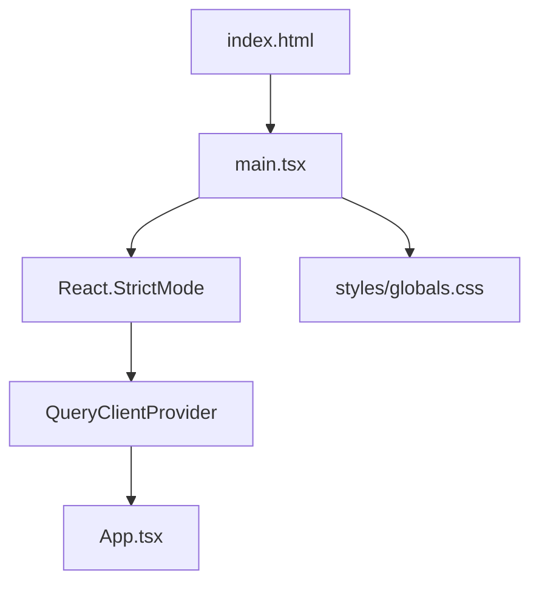

# `main.tsx` -- React 应用入口点与全局配置

> 源文件路径: `ui/src/main.tsx`

## 功能概述

`main.tsx` 是 React 应用的引导文件，负责创建根 DOM 挂载点、初始化 React Query 客户端、配置全局 Provider，并渲染顶层 `App` 组件。

该文件极为精简，遵循 React 18+ 推荐的 `createRoot` API 进行应用挂载。它配置了 React 的 `StrictMode`（用于开发环境的额外检查）和 TanStack Query 的 `QueryClientProvider`（用于全局数据请求缓存管理）。

## 依赖关系

### 导入依赖

| 模块 | 说明 |
|------|------|
| `react` | StrictMode -- React 严格模式包装器 |
| `react-dom/client` | createRoot -- React 18 并发渲染 API |
| `@tanstack/react-query` | QueryClient, QueryClientProvider -- 数据请求状态管理 |
| `./App` | App 根组件 |
| `./styles/globals.css` | 全局样式（Tailwind CSS 和自定义主题变量） |

### 被依赖

| 模块 | 引用内容 |
|------|----------|
| `index.html` | 通过 `<script type="module" src="...">` 标签引用（Vite 入口） |

## 关键类/函数

### `queryClient`

- 类型: `QueryClient`
- 配置:
  - `staleTime: 5000` -- 查询数据 5 秒内视为新鲜，不会自动重新请求
  - `refetchOnWindowFocus: false` -- 窗口重新获得焦点时不自动刷新（避免不必要的请求）
- 说明: 全局单例 QueryClient，为整个应用提供统一的数据请求缓存策略

### 渲染结构

```
StrictMode
  └── QueryClientProvider (client={queryClient})
       └── App
```

## 架构图



## 注意事项

- `StrictMode` 在开发模式下会导致组件双重渲染，这是预期行为，用于检测副作用问题。生产构建中不会激活。
- `staleTime: 5000` 配合各个 Hook 中的 `refetchInterval` 设置，实现了分层的数据更新策略：全局默认 5 秒缓存，各 Hook 可按需覆盖。
- `refetchOnWindowFocus: false` 的选择是因为应用已经有 WebSocket 实时推送和定时轮询，不需要焦点触发的额外刷新。
- 应用通过 Vite 的模块系统加载，`index.html` 中的 `<div id="root">` 是挂载点。
