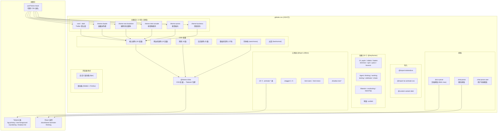

# 样式系统

> `ui/src/styles/globals.css` 是 AutoForge 前端的唯一全局样式文件（1524 行），定义了 6 套主题、动画系统、排版规范和工具类，通过 Tailwind CSS v4 的 `@theme` 指令实现设计令牌集成。

## 目录结构

```
styles/
└── globals.css    # 全局样式 (1524 行)
```

## 文件结构

`globals.css` 按功能区块组织，通过注释分隔：

| 行范围 | 区块 | 说明 |
|--------|------|------|
| 1-5 | 导入 | `tailwindcss` + `tw-animate-css` + 暗色模式 variant |
| 7-126 | Twitter 主题 | 默认主题（亮色 + 暗色） |
| 128-248 | Claude 主题 | 温暖米色调（亮色 + 暗色） |
| 250-395 | Neo Brutalism 主题 | 硬阴影粗线条（亮色 + 暗色） |
| 397-527 | Retro Arcade 主题 | 鲜艳粉青像素风（亮色 + 暗色） |
| 529-662 | Aurora 主题 | 紫色青色极光（亮色 + 暗色） |
| 664-724 | Business 主题 | 深海蓝商务风（亮色 + 暗色） |
| 726-776 | Tailwind v4 集成 | `@theme inline` CSS 变量映射 |
| 778-808 | 基础层 | body 样式、表单继承、主题过渡 |
| 810-1010 | 动画 | 16 个 @keyframes 定义 |
| 1012-1135 | 工具类 | 动画类、字体、阴影 |
| 1137-1272 | 文档排版 | `.docs-prose` 排版规范 |
| 1274-1452 | 聊天排版 | `.chat-prose` + `.chat-prose-user` 排版 |
| 1454-1475 | 滚动条 | 自定义 Webkit 滚动条样式 |
| 1476-1524 | 滑动条 | Webkit + Firefox range input 样式 |

## 主题系统

### 6 套主题

| 主题 | CSS 类 | 主色 | 背景 | 圆角 | 特色 |
|------|--------|------|------|------|------|
| Twitter（默认） | `:root` | 蓝色 `oklch(0.67 0.16 245)` | 纯白 | 0.625rem | 清爽现代 |
| Claude | `.theme-claude` | 橙色 `oklch(0.62 0.14 39)` | 米色 `oklch(0.98 0.005 95)` | 0.5rem | 温暖柔和 |
| Neo Brutalism | `.theme-neo-brutalism` | 橙红 `oklch(0.65 0.23 35)` | 纯白 | 0 (无圆角) | 硬阴影黑边 |
| Retro Arcade | `.theme-retro-arcade` | 粉红 `oklch(0.65 0.22 5)` | 暖灰 `oklch(0.94 0.01 70)` | 0.375rem | 像素风鲜艳 |
| Aurora | `.theme-aurora` | 紫色 `oklch(0.55 0.20 280)` | 浅紫 `oklch(0.98 0.005 290)` | 0.75rem | 极光渐变 |
| Business | `.theme-business` | 海蓝 `oklch(0.20 0.12 265)` | 浅灰 `oklch(0.93 0.005 265)` | 0.375rem | 深色商务 |

每套主题均提供亮色（默认）和暗色（`.dark`）两个变体。

### CSS 变量体系

每套主题定义以下完整变量集：

**核心颜色**：

| 变量 | 说明 |
|------|------|
| `--background` | 页面背景 |
| `--foreground` | 主文字颜色 |
| `--card` / `--card-foreground` | 卡片背景/文字 |
| `--popover` / `--popover-foreground` | 弹出层背景/文字 |
| `--primary` / `--primary-foreground` | 主色/主色上文字 |
| `--secondary` / `--secondary-foreground` | 次要色/次要色上文字 |
| `--muted` / `--muted-foreground` | 柔和色/柔和文字 |
| `--accent` / `--accent-foreground` | 强调色/强调色上文字 |
| `--destructive` / `--destructive-foreground` | 危险色/危险色上文字 |
| `--border` | 边框颜色 |
| `--input` | 输入框背景 |
| `--ring` | 焦点环颜色 |
| `--chart-1` ~ `--chart-5` | 图表色板（5 色） |

**侧边栏颜色**：

| 变量 | 说明 |
|------|------|
| `--sidebar` / `--sidebar-foreground` | 侧边栏背景/文字 |
| `--sidebar-primary` / `--sidebar-primary-foreground` | 侧边栏主色 |
| `--sidebar-accent` / `--sidebar-accent-foreground` | 侧边栏强调色 |
| `--sidebar-border` / `--sidebar-ring` | 侧边栏边框/焦点环 |

**阴影**：

| 变量 | 说明 |
|------|------|
| `--shadow-sm` | 小阴影 |
| `--shadow` | 默认阴影 |
| `--shadow-md` | 中阴影 |
| `--shadow-lg` | 大阴影 |

**日志颜色**：

| 变量 | 说明 |
|------|------|
| `--color-log-error` | 错误日志（红） |
| `--color-log-warning` | 警告日志（黄） |
| `--color-log-info` | 信息日志（蓝） |
| `--color-log-debug` | 调试日志（灰） |
| `--color-log-success` | 成功日志（绿） |

**看板状态颜色**：

| 变量 | 说明 |
|------|------|
| `--color-status-pending` | 待处理列 |
| `--color-status-progress` | 进行中列 |
| `--color-status-done` | 已完成列 |

**字体**：

| 变量 | 说明 |
|------|------|
| `--font-sans` | 无衬线字体栈 |
| `--font-mono` | 等宽字体栈 |

**过渡**：

| 变量 | 说明 |
|------|------|
| `--transition-fast` | 快速过渡 (150ms) |
| `--transition-normal` | 正常过渡 (250ms) |
| `--ease-smooth` | 平滑缓动函数 |

## Tailwind v4 集成

通过 `@theme inline` 指令（730-776 行），将 CSS 变量映射为 Tailwind 设计令牌：

```css
@theme inline {
  /* 圆角计算 */
  --radius-sm: calc(var(--radius) - 4px);
  --radius-md: calc(var(--radius) - 2px);
  --radius-lg: var(--radius);
  --radius-xl: calc(var(--radius) + 4px);
  --radius-2xl: calc(var(--radius) + 8px);
  /* ... */

  /* 颜色令牌 */
  --color-background: var(--background);
  --color-foreground: var(--foreground);
  --color-primary: var(--primary);
  /* ... 24 个颜色令牌 */

  /* 字体 */
  --font-sans: var(--font-sans);
  --font-mono: var(--font-mono);

  /* 阴影 */
  --shadow-sm: var(--shadow-sm);
  --shadow: var(--shadow);
  --shadow-md: var(--shadow-md);
  --shadow-lg: var(--shadow-lg);
}
```

这使得 Tailwind 类（如 `bg-primary`, `text-foreground`, `rounded-lg`）自动使用当前主题的 CSS 变量值。

## 动画系统

### @keyframes 定义

**UI 基础动画**：

| 动画名 | 效果 | 用途 |
|--------|------|------|
| `popIn` | 缩放 0.95→1 + 渐显 | 弹出元素入场 |
| `slideIn` | 左移 10px→0 + 渐显 | 侧边滑入 |
| `slideInUp` | 下移 10px→0 + 渐显 | 底部滑入 |
| `slideInDown` | 上移 10px→0 + 渐显 | 顶部滑入 |
| `fadeIn` | 纯渐显 | 通用渐变 |
| `shimmer` | 背景渐变横移 | 文字闪光 |
| `spin` | 360 度旋转 | 加载指示器 |
| `pulse` | 透明度 1→0.5→1 | 脉冲闪烁 |
| `bounce` | 上下跳动 4px | 弹跳效果 |

**Agent 吉祥物动画**：

| 动画名 | 效果 | 触发状态 |
|--------|------|----------|
| `thinking` | 微缩放 + 微上下移 (1.5s) | Agent 思考中 |
| `working` | 左右微抖 1px (0.3s) | Agent 工作中 |
| `testing` | 左右微转 3deg (0.8s) | Agent 测试中 |
| `celebrate` | 缩放 1→1.15 + 转动 (0.6s) | Agent 成功 |
| `shake` | 左右抖动 2px (0.5s) | Agent 出错/挣扎 |

**编排器（Maestro）动画**：

| 动画名 | 效果 | 触发状态 |
|--------|------|----------|
| `conducting` | 指挥棒摆动 (1s) | 编排器调度中 |
| `batonTap` | 指挥棒轻点 (0.6s) | 编排器轻敲 |

**特效动画**：

| 动画名 | 效果 | 用途 |
|--------|------|------|
| `confetti` | 下落 + 旋转 720deg + 渐隐 | 彩纸特效 |

### 工具类

```css
@layer utilities {
  /* UI 动画 */
  .animate-pop-in          /* popIn 0.2s */
  .animate-slide-in        /* slideIn 0.2s */
  .animate-slide-in-up     /* slideInUp 0.2s */
  .animate-slide-in-down   /* slideInDown 0.2s */
  .animate-fade-in         /* fadeIn 0.2s */
  .animate-shimmer         /* 渐变文字闪光 2s 循环 */
  .animate-spin            /* 旋转 1s 循环 */
  .animate-pulse           /* 脉冲 2s 循环 */
  .animate-bounce          /* 弹跳 2s 循环 */

  /* Agent 动画 */
  .animate-thinking        /* 思考 1.5s 循环 */
  .animate-working         /* 工作 0.3s 循环 */
  .animate-testing         /* 测试 0.8s 循环 */
  .animate-celebrate       /* 庆祝 0.6s 单次 */
  .animate-shake           /* 抖动 0.5s 循环 */
  .animate-confetti        /* 彩纸下落 2s 单次 */

  /* 编排器动画 */
  .animate-conducting      /* 指挥 1s 循环 */
  .animate-baton-tap       /* 轻点 0.6s 循环 */
  .animate-maestro-idle    /* 空闲=弹跳 2s 循环 */
  .animate-maestro-complete /* 完成=庆祝 0.8s 单次 */

  /* 交错延迟 */
  .stagger-1  /* 50ms */
  .stagger-2  /* 100ms */
  .stagger-3  /* 150ms */
  .stagger-4  /* 200ms */
  .stagger-5  /* 250ms */

  /* 字体 */
  .font-sans  /* var(--font-sans) */
  .font-mono  /* var(--font-mono) */

  /* Neo Brutalism 阴影 */
  .shadow-neo     /* var(--shadow-md) */
  .shadow-neo-sm  /* var(--shadow-sm) */
  .shadow-neo-lg  /* var(--shadow-lg) */
}
```

## 排版系统

### 文档排版 (`.docs-prose`)

用于应用内文档页面（`/#/docs`）的完整排版规范：

| 元素 | 样式 |
|------|------|
| 行高 | 1.7 |
| 颜色 | `var(--muted-foreground)` |
| h2 | 1.5rem 粗体，上方 3rem 边距，底部 2px 边框 |
| h3 | 1.15rem 半粗体，上方 2rem 边距 |
| p | 最大宽度 65ch |
| code（行内） | 柔和背景，圆角，等宽字体 0.8125rem |
| pre | 柔和背景，边框，等宽字体 0.8125rem，行高 1.6 |
| table | 全宽，折叠边框，偶数行半透明背景 |
| blockquote | 左 4px 主色边框，斜体 |
| a | 主色，下划线，偏移 2px |
| strong | 前景色，半粗体 |

### 聊天排版 (`.chat-prose`)

用于聊天气泡内的紧凑 Markdown 排版：

| 元素 | 与文档排版的差异 |
|------|------------------|
| 行高 | 1.6（更紧凑） |
| 间距 | 整体减半（0.5rem 代替 1rem） |
| code | 0.75rem（更小） |
| 首/末子元素 | 移除上/下外边距 |

### 用户消息排版 (`.chat-prose-user`)

覆盖 `.chat-prose` 在主色背景气泡中的样式：

| 元素 | 样式 |
|------|------|
| pre | `background: rgb(255 255 255 / 0.15)` 半透明白 |
| code | 半透明白背景 |
| th | 半透明白背景 |
| th, td 边框 | `rgb(255 255 255 / 0.2)` |
| blockquote 边框 | `rgb(255 255 255 / 0.5)` |
| a | 继承颜色 |

## 其他样式

### 自定义滚动条

```css
::-webkit-scrollbar { width: 8px; height: 8px; }
::-webkit-scrollbar-track { background: transparent; }
::-webkit-scrollbar-thumb { background: var(--border); border-radius: var(--radius); }
::-webkit-scrollbar-thumb:hover { background: var(--muted-foreground); }
```

### 滑动条样式

同时兼容 Webkit（`-webkit-slider-thumb`）和 Firefox（`-moz-range-thumb`）：
- 16px 圆形滑块，主色背景
- 悬停时 1.15x 放大
- 8px 圆角轨道

## 架构图



## 关键模式

1. **CSS 变量驱动**: 所有颜色、阴影、字体通过 CSS 变量定义，主题切换零 JavaScript 运行时开销
2. **Tailwind v4 @theme 桥接**: `@theme inline` 将 CSS 变量映射为 Tailwind 设计令牌，实现 `bg-primary` 等类名自动跟随主题
3. **暗色模式双层**: `.dark` 类应用于 `<html>`，通过 `@custom-variant dark` 启用 Tailwind 的 `dark:` 前缀
4. **oklch 色空间**: 所有主题颜色使用 oklch 色空间，确保感知均匀的颜色过渡
5. **动画状态映射**: Agent 动画类名（`.animate-thinking`/`.animate-working` 等）与后端推送的 `AgentState` 枚举一一对应
6. **排版隔离**: `.docs-prose` 和 `.chat-prose` 完全独立，前者宽松舒适适合阅读，后者紧凑适合对话
7. **跨浏览器**: 滑动条和滚动条同时覆盖 Webkit 和 Firefox 前缀
