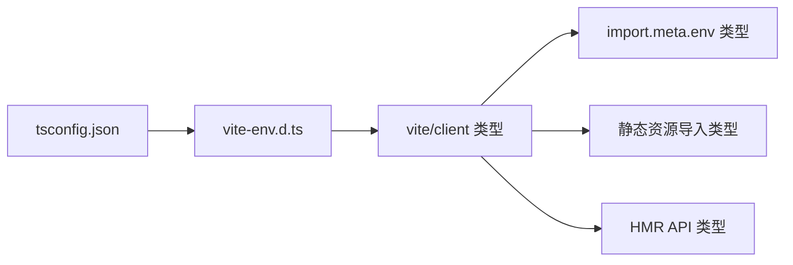

# `vite-env.d.ts` -- Vite 环境类型声明

> 源文件路径: `ui/src/vite-env.d.ts`

## 功能概述

`vite-env.d.ts` 是一个 TypeScript 类型声明文件，仅包含一行三斜杠指令，引入 Vite 提供的客户端类型定义。

该文件使 TypeScript 编译器能够识别 Vite 特有的功能，包括：`import.meta.env` 环境变量类型、静态资源导入类型（如 `.svg`、`.png`、`.css` 等模块的类型声明）、`import.meta.hot` HMR 热更新 API 类型，以及其他 Vite 注入的全局类型。

## 依赖关系

### 导入依赖

| 模块 | 说明 |
|------|------|
| `vite/client` | Vite 客户端类型定义（通过三斜杠引用指令） |

### 被依赖

| 模块 | 引用内容 |
|------|----------|
| TypeScript 编译器 | 通过 `tsconfig.json` 中的 `include` 配置自动包含 |

## 关键类/函数

### `/// <reference types="vite/client" />`

- 说明: TypeScript 三斜杠指令，将 `vite/client` 包中声明的所有类型添加到全局类型环境中。这使得以下功能在整个项目中可用：
  - `import.meta.env.DEV` / `import.meta.env.PROD` -- 开发/生产环境标记
  - `import.meta.env.MODE` -- 当前模式字符串
  - `import.meta.env.VITE_*` -- 自定义环境变量
  - 静态资源模块导入（如 `import logo from './logo.png'` 返回 string 类型）

## 架构图

## 注意事项

- 此文件由 Vite 脚手架自动生成，不应删除或修改，否则 TypeScript 编译器将无法识别 Vite 特有的全局类型。
- 文件中不包含任何运行时代码，仅在 TypeScript 编译阶段生效。
- 项目中使用的 `import.meta.env.DEV` 条件判断（如 `useAssistantChat.ts` 中的调试日志）依赖此文件提供的类型。
